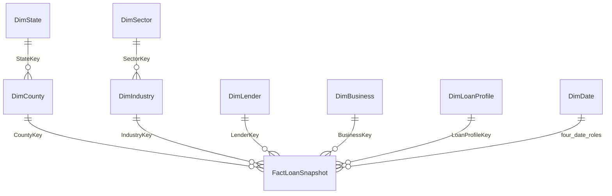

# Mô hình kho dữ liệu

## Grain và phạm vi

`FactLoanSnapshot`: một dòng của file công bố SBA 7(a), snapshot 2026-06-30. Một lần build chỉ nhận một AsOfDate (lưu ở metadata `profile.json` và tài liệu mô tả, không tạo khóa `AsOfDateKey` trong bảng fact vì toàn bộ bản ghi có cùng một ngày snapshot). Fact tích hợp ngày sự kiện nhưng không có lịch sử thay đổi status. Không cộng số tiền qua các snapshot; muốn mở rộng cần chiến lược nhận diện loan đáng tin cậy và snapshot measure group riêng.

| Dimension | Dòng sau build | Thuộc tính và chú ý |
|---|---:|---|
| DimDate | 2.466 | Calendar/Fiscal year, quarter, month; lịch liên tục, 4 role-playing dates |
| DimState | 54 | ProjectState, bao gồm lãnh thổ; không gọi tất cả là 54 bang |
| DimCounty | 3.055 | Khóa theo StateKey + ProjectCounty, không chỉ county name |
| DimSector | 20 | Nhóm NAICS; gộp 31–33, 44–45, 48–49 |
| DimIndustry | 1.171 | SectorKey, NaicsCode, NaicsDescription; giữ biến thể mô tả |
| DimLender | 2.338 | LocationID và thông tin ngân hàng hiện tại; khóa theo tuple thuộc tính |
| DimBusiness | 7.874 | Hồ sơ BusinessType/Age/Franchise, không phải danh sách borrower duy nhất |
| DimLoanProfile | 357 | Program, method, fixed/variable, revolver, collateral, sold market, status |

DimBusiness và DimLoanProfile là dimension nhóm thuộc tính. Không tạo hierarchy BusinessType → BusinessAge vì không có phụ thuộc hàm. Tương tự không đặt county dưới lender. County và Sector là hai nhánh snowflake thực sự. Borrower name/address không cần ở cube; giữ ở raw để kiểm tra.

Date roles: Approval Date (mặc định), First Disbursement Date, Paid In Full Date, Charge Off Date. Ngày thiếu lưu NULL; SSAS bật UnknownMember và xử lý NullProcessing phù hợp. Mọi role dùng cùng DimDate. DDL dùng FK, dữ liệu text thiếu thành `Unknown`; không đổi ngày thiếu thành 1900-01-01.

## Measures

Các SUM chỉ có tính cộng được trên tập dòng không trùng và **một snapshot**. Lãi suất và tỷ lệ phải tính lại sau rollup.

| Measure cube | Cột/công thức | Ý nghĩa |
|---|---|---|
| Loan Count | SUM(LoanCount) | Số dòng nguồn, proxy số khoản công bố |
| Gross Approval | SUM(GrossApproval) | USD được phê duyệt, bao gồm cả canceled |
| Guaranteed Approval | SUM(SBAGuaranteedApproval) | USD được SBA bảo lãnh |
| Unguaranteed Approval | SUM(UnguaranteedApproval) | Approval − Guaranteed, không phải dư nợ lender |
| Charge Off Amount | SUM(GrossChargeOffAmount) | Gốc ghi giảm gộp được công bố |
| Jobs Supported | SUM(JobsSupported) | Tổng số việc làm báo cáo theo khoản |
| Charge Off Count | SUM(ChargeOffCount) | Status = CHGOFF |
| Resolved Count | SUM(ResolvedCount) | Status thuộc PIF, CHGOFF |
| Non Cancelled Count | SUM(NonCancelledCount) | Không thuộc CANCLD |
| Non Cancelled Approval | SUM(NonCancelledApproval) | Approval không bao gồm CANCLD |
| Average Loan | Gross Approval / Loan Count | USD/dòng |
| Guarantee Ratio | Guaranteed Approval / Gross Approval | Ratio của các tổng |
| Resolved Charge Off Rate | Charge Off Count / Resolved Count | Có selection/censoring bias |
| Charge Off Amount Ratio | Charge Off Amount / Gross Approval | Không phải LGD hay tổn thất ròng |
| Weighted Initial Rate | SUM(InterestWeightedAmount) / SUM(InterestKnownApproval) | Lãi suất bình quân có trọng số số tiền, chỉ dòng biết rate |
| Average Term | SUM(TermTotal) / Loan Count | Tháng, không cộng lãi suất/kỳ hạn để diễn giải |
| Average Disbursement Days | SUM(DisbursementDaysTotal) / SUM(DisbursementObservedCount) | Chỉ dòng có ngày giải ngân hợp lệ |
| Approval Per Job | Gross Approval / Jobs Supported | USD/việc làm báo cáo; không có ý nghĩa khi mẫu số 0 |

Các mẫu số bằng 0 trả NULL/blank. InitialInterestRate nguồn là phần trăm, ví dụ 11.04 → 0.1104 khi nhân trọng số. Không dùng trung bình của các tỷ lệ nhóm. Không bật SUM trực tiếp InitialInterestRate thành KPI.

## Lưu trữ và đổi phiên bản

CSV/Python dùng số thực cho thăm dò; SQL dùng DECIMAL, kiểm tra chênh lệch tới độ chính xác nguồn. Không làm tròn tiền về integer. Source SHA-256 trong manifest là căn cứ tái lập. Khóa dimension có thể đổi sau full rebuild; nạp lại đồng bộ tất cả bảng và process full cube. Không dùng các khóa này để nối snapshot khác hoặc file Excel cũ.

NAICS version không được cung cấp trong CSV, nên chỉ gộp sector thô theo mã và giữ nguyên code/description; chưa khẳng định các mã chi tiết qua mọi năm đồng nhất về định nghĩa. Cấu trúc sector tham khảo [US Census](https://www.census.gov/programs-surveys/economic-census/data/tables/industry.html).
