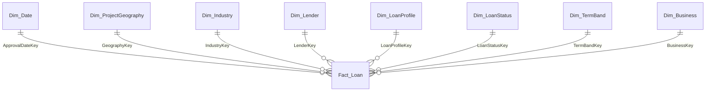

# Mô hình logic theo Chương 1 mới nhất

> Đồng bộ 2026-10-02 theo [report Chương 1](../../project_report/Chuong1/IS217.R11_24521176_24520479_BTA11.docx) §1.3.3–1.3.5. Star **1 `Fact_Loan` + 8 dimensions** là mô hình được trình bày trong báo cáo; báo cáo vẫn dùng từ “đề xuất”. Không coi đây là physical DDL đã triển khai. [DBML](../../diagram/candidate_schema.dbml) gần khớp mô hình nhưng còn khác datatype; [SQL cũ](../../sql/01_warehouse.sql) là prototype snowflake.

## Grain và khóa

Mỗi dòng `Fact_Loan` là một published record tại snapshot **2026-06-30**, không phải unique loan hoặc unique business. Giữ exact duplicates. PK kỹ thuật `LoanKey` không phải SBA LoanID. Lineage: `SourceFileID` + `SourceRecordOrdinal`; `SourceRowNumber` là thông tin dòng vật lý hỗ trợ, không thay ordinal vì nguồn có ô nhiều dòng. `ETLBatchID` nhận diện lần nạp. `AsOfDate` phải còn trong metadata snapshot/source dù không được liệt kê là cột Fact trong bảng 1.12.

Fact có 8 FK: `ApprovalDateKey→Dim_Date.DateKey`, `GeographyKey→Dim_ProjectGeography.GeographyKey`, `IndustryKey→Dim_Industry.IndustryKey`, `LenderKey→Dim_Lender.LenderKey`, `LoanProfileKey→Dim_LoanProfile.LoanProfileKey`, `LoanStatusKey→Dim_LoanStatus.LoanStatusKey`, `TermBandKey→Dim_TermBand.TermBandKey`, `BusinessKey→Dim_Business.BusinessKey`. Chỉ ApprovalDate có relationship tới Dim_Date trong scope hiện tại; ba ngày sự kiện được report đặt trực tiếp trong Fact.

## Business keys và lookup

Report liệt kê PK kỹ thuật/FK nhưng **không định nghĩa đầy đủ business key, UNIQUE, độ dài VARCHAR, nullability, identity, Unknown member hoặc chiến lược SCD**. Các lựa chọn dưới đây là hợp đồng lookup kế thừa/cần review khi viết Source-to-Target Mapping:

| Dimension | Business key / lookup | Mức xác nhận |
|---|---|---|
| `Dim_Date` | `FullDate` | Lookup theo ngày; encoding `DateKey` còn thuộc physical mapping. |
| `Dim_ProjectGeography` | Tuple các thuộc tính địa lý được chọn | County luôn đi với state; district là nhánh riêng, không mặc định phụ thuộc county. Tuple đầy đủ OPEN. |
| `Dim_Industry` | Raw `(NaicsCode, NaicsDescription)` | Không chỉ dùng code khi source có nhiều description; version/crosswalk OPEN. |
| `Dim_Lender` | `LocationID` | Candidate lender grouping key; không là LoanID, giữ text. |
| `Dim_LoanProfile` | Tuple method + thuộc tính hồ sơ | Tuple/null normalization OPEN. |
| `Dim_LoanStatus` | Raw status + mapping | Giữ raw `P I F`, canonical `PIF`; mapping version cần audit. |
| `Dim_TermBand` | `TermBandCode` + rule version nếu cần | Nhóm project-defined, không phải phân loại SBA. |
| `Dim_Business` | `(BusinessTypeRaw, BusinessAgeRaw)` | Classification, không borrower identity; missing khác Unanswered và Unknown lookup. |

## Danh mục thuộc tính theo report

Bảng dưới trích từ bảng 1.4–1.12, giữ datatype logic mà report ghi. §1.2.2.4 yêu cầu tiền tệ **DECIMAL(18,3)**; các bảng model chỉ ghi DECIMAL. Không tự suy ra length/constraint từ DBML.

### Dim_Date

| STT | Loại | Tên thuộc tính | Kiểu dữ liệu | Mô tả |
| --- | --- | --- | --- | --- |
| 1 | Khóa chính | DateKey | INTEGER | Khóa chính kỹ thuật của bảng ngày. |
| 2 |  | FullDate | DATE | Ngày đầy đủ. |
| 3 |  | CalendarYear | INTEGER | Năm dương lịch. |
| 4 |  | CalendarQuarter | INTEGER | Quý dương lịch. |
| 5 |  | CalendarMonth | INTEGER | Tháng dương lịch. |
| 6 |  | MonthName | VARCHAR | Tên tháng. |
| 7 |  | FiscalYear | INTEGER | Năm tài chính. |
| 8 |  | FiscalQuarter | INTEGER | Quý tài chính. |
| 9 |  | FiscalMonth | INTEGER | Thứ tự tháng trong năm tài chính. |

### Dim_ProjectGeography

| STT | Loại | Tên thuộc tính | Kiểu dữ liệu | Mô tả |
| --- | --- | --- | --- | --- |
| 1 | Khóa chính | GeographyKey | BIGINT | Khóa chính kỹ thuật của bảng địa lý. |
| 2 |  | ProjectState | VARCHAR | Bang hoặc vùng lãnh thổ của dự án. |
| 3 |  | ProjectCounty | VARCHAR | Quận/hạt của dự án. |
| 4 |  | CongressionalDistrict | VARCHAR | Khu vực bầu cử Quốc hội liên quan đến dự án. |
| 5 |  | SBADistrictOffice | VARCHAR | Văn phòng khu vực SBA liên quan đến hồ sơ. |
| 6 |  | GeographyValueStatus | VARCHAR | Trạng thái kiểm tra hoặc chuẩn hóa giá trị địa lý. |

### Dim_Industry

| STT | Loại | Tên thuộc tính | Kiểu dữ liệu | Mô tả |
| --- | --- | --- | --- | --- |
| 1 | Khóa chính | IndustryKey | BIGINT | Khóa chính kỹ thuật của bảng ngành. |
| 2 |  | NaicsCode | VARCHAR | Mã NAICS trong dữ liệu nguồn. |
| 3 |  | NaicsDescription | VARCHAR | Mô tả mã NAICS. |
| 4 |  | NaicsSectorCode | VARCHAR | Mã sector được ánh xạ từ mã NAICS. |
| 5 |  | NaicsSectorName | VARCHAR | Tên sector tương ứng. |
| 6 |  | NaicsVersion | VARCHAR | Phiên bản NAICS được sử dụng cho quá trình ánh xạ. |
| 7 |  | SectorMappingStatus | VARCHAR | Trạng thái xác minh hoặc ánh xạ mã NAICS sang sector. |

### Dim_Lender

| STT | Loại | Tên thuộc tính | Kiểu dữ liệu | Mô tả |
| --- | --- | --- | --- | --- |
| 1 | Khóa chính | LenderKey | BIGINT | Khóa chính kỹ thuật của bảng lender. |
| 2 |  | LocationID | VARCHAR | Mã định danh lender SBA trong nguồn. |
| 3 |  | BankName | VARCHAR | Tên lender hiện được gán cho khoản vay. |
| 4 |  | BankFDICNumber | VARCHAR | Mã FDIC của lender, nếu có. |
| 5 |  | BankNCUANumber | VARCHAR | Mã NCUA của lender, nếu có. |
| 6 |  | BankStreet | VARCHAR | Địa chỉ đường phố của lender. |
| 7 |  | BankCity | VARCHAR | Thành phố trong địa chỉ lender. |
| 8 |  | BankState | VARCHAR | Bang trong địa chỉ lender. |
| 9 |  | BankZip | VARCHAR | Mã ZIP trong địa chỉ lender. |
| 10 |  | LenderValueStatus | VARCHAR | Trạng thái kiểm tra hoặc chuẩn hóa thông tin lender. |

### Dim_LoanProfile

| STT | Loại | Tên thuộc tính | Kiểu dữ liệu | Mô tả |
| --- | --- | --- | --- | --- |
| 1 | Khóa chính | LoanProfileKey | BIGINT | Khóa chính kỹ thuật của bảng đặc điểm khoản vay. |
| 2 |  | ProcessingMethod | VARCHAR | Phương thức xử lý hồ sơ. |
| 3 |  | FixedOrVariableInterestInd | VARCHAR | Giá trị đã chuẩn hóa từ FixedorVariableInterestInd trong nguồn. |
| 4 |  | RevolverStatus | VARCHAR | Trạng thái khoản vay quay vòng. |
| 5 |  | CollateralInd | VARCHAR | Chỉ báo liên quan đến tài sản bảo đảm. |
| 6 |  | LoanProfileValueStatus | VARCHAR | Trạng thái kiểm tra hoặc chuẩn hóa thông tin hồ sơ. |

### Dim_LoanStatus

| STT | Loại | Tên thuộc tính | Kiểu dữ liệu | Mô tả |
| --- | --- | --- | --- | --- |
| 1 | Khóa chính | LoanStatusKey | BIGINT | Khóa chính kỹ thuật của bảng trạng thái khoản vay. |
| 2 |  | RawStatus | VARCHAR | Giá trị trạng thái nguyên bản trong dữ liệu nguồn. |
| 3 |  | CanonicalStatus | VARCHAR | Giá trị trạng thái sau khi áp dụng quy tắc chuẩn hóa được phê duyệt. |
| 4 |  | StatusMappingStatus | VARCHAR | Trạng thái của quá trình ánh xạ trạng thái. |

### Dim_TermBand

| STT | Loại | Tên thuộc tính | Kiểu dữ liệu | Mô tả |
| --- | --- | --- | --- | --- |
| 1 | Khóa chính | TermBandKey | BIGINT | Khóa chính kỹ thuật của bảng nhóm kỳ hạn. |
| 2 |  | TermBandCode | VARCHAR | Mã nhóm kỳ hạn. |
| 3 |  | TermBandName | VARCHAR | Tên nhóm kỳ hạn. |
| 4 |  | MinMonths | INTEGER | Số tháng nhỏ nhất của nhóm, nếu áp dụng. |
| 5 |  | MaxMonths | INTEGER | Số tháng lớn nhất của nhóm, nếu áp dụng. |
| 6 |  | SortOrder | INTEGER | Thứ tự hiển thị của nhóm. |
| 7 |  | BandStatus | VARCHAR | Trạng thái nhóm kỳ hạn, dùng để phân biệt nhóm hợp lệ và nhóm phục vụ kiểm tra chất lượng dữ liệu. |

### Dim_Business

| STT | Loại | Tên thuộc tính | Kiểu dữ liệu | Mô tả |
| --- | --- | --- | --- | --- |
| 1 | Khóa chính | BusinessKey | BIGINT | Khóa chính kỹ thuật của bảng đặc điểm doanh nghiệp. |
| 2 |  | BusinessTypeRaw | VARCHAR | Loại hình doanh nghiệp theo dữ liệu nguồn. |
| 3 |  | BusinessAgeRaw | VARCHAR | Nhãn giai đoạn hoặc tình trạng doanh nghiệp theo dữ liệu nguồn. |
| 4 |  | BusinessTypeValueStatus | VARCHAR | Trạng thái kiểm tra giá trị BusinessType. |
| 5 |  | BusinessAgeValueStatus | VARCHAR | Trạng thái kiểm tra giá trị BusinessAge. |

### Fact_Loan

| STT | Loại | Tên thuộc tính | Kiểu dữ liệu | Mô tả |
| --- | --- | --- | --- | --- |
| 1 | Khóa chính | LoanKey | BIGINT | Khóa kỹ thuật duy nhất của mỗi dòng trong bảng Fact; không phải SBA LoanID. |
| 2 |  | ApprovalDateKey | INTEGER | Khóa liên kết với ngày phê duyệt trong Dim_Date. |
| 3 |  | GeographyKey | BIGINT | Khóa liên kết với Dim_ProjectGeography. |
| 4 |  | IndustryKey | BIGINT | Khóa liên kết với Dim_Industry. |
| 5 |  | LenderKey | BIGINT | Khóa liên kết với Dim_Lender. |
| 6 |  | LoanProfileKey | BIGINT | Khóa liên kết với Dim_LoanProfile. |
| 7 |  | LoanStatusKey | BIGINT | Khóa liên kết với Dim_LoanStatus. |
| 8 |  | TermBandKey | BIGINT | Khóa liên kết với Dim_TermBand. |
| 9 |  | BusinessKey | BIGINT | Khóa liên kết với Dim_Business. |
| 10 |  | GrossApproval | DECIMAL | Tổng giá trị được phê duyệt. |
| 11 |  | SBAGuaranteedApproval | DECIMAL | Giá trị được SBA bảo lãnh tại thời điểm phê duyệt. |
| 12 |  | GrossChargeOffAmount | DECIMAL | Giá trị gross charge-off được ghi nhận. |
| 13 |  | JobsSupported | INTEGER | Số việc làm được lender báo cáo là được hỗ trợ. |
| 14 |  | RecordCount | INTEGER | Base measure kỹ thuật, nhận giá trị 1 cho mỗi published record. |
| 15 |  | TermInMonths | INTEGER | Thời hạn khoản vay tính theo tháng. |
| 16 |  | FirstDisbursementDate | DATE | Ngày giải ngân đầu tiên, nếu có. |
| 17 |  | PaidInFullDate | DATE | Ngày khoản vay được ghi nhận đã thanh toán đầy đủ, nếu có. |
| 18 |  | ChargeOffDate | DATE | Ngày khoản vay được ghi nhận charge-off, nếu có. |
| 19 |  | SourceFileID | VARCHAR | Mã nhận diện file nguồn. |
| 20 |  | SourceRecordOrdinal | BIGINT | Thứ tự logic của bản ghi trong dữ liệu nguồn, phục vụ lineage và kiểm soát trùng lặp. |
| 21 |  | SourceRowNumber | BIGINT | Thông tin dòng vật lý hỗ trợ truy vết; không đồng nhất với SourceRecordOrdinal. |
| 22 |  | ETLBatchID | VARCHAR | Mã nhận diện lần nạp dữ liệu ETL. |

## Derived attributes và measures

`FiscalYear = year(ApprovalDate) + 1` nếu tháng ≥10, ngược lại year; `FiscalQuarter=((month+2)%12)//3+1`; `FiscalMonth=((month+2)%12)+1`. Q6: FY2020 không có YoY; FY2026 (2025-10-01..2026-06-30) so FY2025 cùng kỳ (2024-10-01..2025-06-30).

`NaicsSectorCode/Name` dùng cùng reference; `NaicsVersion` chưa được suy đoán, mapping hiện chỉ `CANDIDATE_UNVERIFIED`. `CanonicalStatus`: giữ raw và chuẩn hóa `P I F→PIF`. `TermBandCode`: ZERO=0, SHORT=1–60, MEDIUM=61–119, TERM_120=120, LONG=121–240, VERY_LONG>240; MISSING/INVALID giữ riêng. Nhãn và BandStatus theo rule tương ứng. Không chuyển BusinessAge thành tuổi số.

Base measures: `GrossApproval`, `SBAGuaranteedApproval`, `GrossChargeOffAmount`, `JobsSupported`, `RecordCount=1`; additive trong một snapshot. `TermInMonths` không SUM thành KPI. Average, ratio, share, YoY, ranking, StructuralShiftScore và contribution tính lúc truy vấn, cùng population; mẫu số 0→NULL. Xem [Measure Contract](../business_requirements/measure_contract_q1_q15.md) và [Matrix](measure_dimension_matrix.md).

## Open physical issues

DBML/SVG dùng decimal(19,2), khác DECIMAL(18,3) ở preprocessing; report cũng có hình schema cũ mang precision này. Report ghi TermBandKey BIGINT, DBML dùng int. Giữ nguyên cấu trúc DBML/SQL; xử lý trong task mapping/physical schema sau. Xem [audit và Open Issues](../00_current_status.md#open-issues-report-va-implementation).
