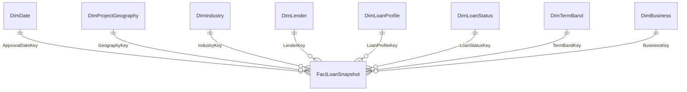

# Candidate logical star schema — SBA 7(a)

> **PROPOSED TARGET SCHEMA — 1 Fact + 8 Dimensions**, cập nhật 2026-09-30. Người dùng đã duyệt mô hình logic star, Q10/`DimBusiness` và năm nhóm rule phân tích ở cấp dự án. Đây chưa phải `Final Schema` hoặc physical mapping; NAICS reference/version/mapping còn `PENDING_VERIFICATION`. Chưa tạo/nạp database, chưa thay Python/SQL/MDX prototype. [Thiết kế snowflake cũ](../archive/dimensional_model/02_warehouse_design.md) được giữ làm `Previous Prototype`.

## Grain và định danh

Một dòng `FactLoanSnapshot` đại diện **một published record trong CSV SBA 7(a) tại snapshot 2026-06-30**. Không đồng nhất với một unique business loan hoặc một business duy nhất. Giữ cả các dòng exact duplicate. `LoanSnapshotKey` là surrogate technical PK của dòng fact, **không phải SBA LoanID**. Candidate lineage là `SourceFileID` + `SourceRecordOrdinal` (có thể ràng buộc `UNIQUE` nếu file identity ổn định); `SourceRowNumber` chỉ là thông tin hỗ trợ vì CSV có ô nhiều dòng và ordinal bản ghi không mặc nhiên bằng số dòng vật lý. `AsOfDate` là metadata của snapshot trong phạm vi một file, không phải time series để cộng measures qua nhiều snapshots.

## FactLoanSnapshot

| Nhóm | Candidate columns | Vai trò |
|---|---|---|
| PK/lineage | `LoanSnapshotKey`; `SourceFileID`, `SourceRecordOrdinal`, `SourceRowNumber`, `ETLBatchID` trong fact hoặc audit liên kết 1:1 | Phân biệt mọi dòng nguồn và tái lập mapping; cách lưu vật lý và `UNIQUE(SourceFileID, SourceRecordOrdinal)` cần review. |
| FKs | `ApprovalDateKey`, `GeographyKey`, `IndustryKey`, `LenderKey`, `LoanProfileKey`, `LoanStatusKey`, `TermBandKey`, `BusinessKey` | 8 FK đến 8 dimensions. `BusinessKey` trỏ tới `DimBusiness`, không đổi grain. Chỉ `ApprovalDateKey` là date role phục vụ Q1–Q15. |
| Additive base measures | `GrossApproval`, `SBAGuaranteedApproval`, `GrossChargeOffAmount`, `JobsSupported`, `RecordCount=1` | Chỉ cộng trong **một snapshot** và đúng population. |
| Source validation và event dates | `TermInMonths`, `FirstDisbursementDate`, `PaidInFullDate`, `ChargeOffDate` trong fact, staging hoặc audit truy vết | Không SUM kỳ hạn như KPI; cần kiểm và tái tạo `TermBand` khi rule đổi. Các ngày sự kiện chưa là date roles của Q1–Q15; vị trí vật lý còn review. |

Không lưu trực tiếp `Average`, `Ratio`, `Share`, `YoY`, `Ranking`, `StructuralShiftScore`, `ContributionShare` hoặc `CHGOFFShare` như additive measures. Q15 gross charge-off theo cohort lọc `CHGOFF` ở semantic/query layer; status không biến count thành default probability.

## Eight dimensions

| Dimension | Key và thuộc tính tối thiểu | Phục vụ | Dependency |
|---|---|---|---|
| `DimDate` | `DateKey`, ngày, `FiscalYear`, `FiscalQuarter`, `FiscalMonth` | Q1–Q4, Q6–Q8, Q10–Q15 | FY bắt đầu 01/10; đối chiếu `ApprovalFY` nguồn. Chỉ approval date relationship hiện hành. |
| `DimProjectGeography` | `GeographyKey`, `ProjectState`, `ProjectCounty` | Q3, Q8–Q9, Q13, Q15 | County phải đi cùng state; gồm bang/lãnh thổ. |
| `DimIndustry` | `IndustryKey`, raw `NaicsCode`, `NaicsDescription`; candidate `NaicsSectorCode`, `NaicsSectorName`, `NaicsVersion`, `SectorMappingStatus` | Q13, Q15 | Cấp phân tích NAICS Sector `PROJECT_APPROVED`; reference/version/crosswalk và giá trị sector còn `PENDING_VERIFICATION`. Không ghi vintage tự suy đoán vào `NaicsVersion`. |
| `DimLender` | `LenderKey`, `LocationID`, `BankName` | Q5, Q14 | Nhóm lender theo `LocationID`; `BankName` là tên hiện được gán. |
| `DimLoanProfile` | `LoanProfileKey`, raw `ProcessingMethod`; các đặc tính hồ sơ khác chỉ thêm khi có Q/rule | Q2, Q4, Q7, Q11, Q14 | Không chứa `LoanStatus` hoặc `BusinessType`/`BusinessAge`. Chưa canonicalize 19 nhãn method nguồn. |
| `DimLoanStatus` | `LoanStatusKey`, `RawStatus`, `CanonicalStatus`, `StatusMappingStatus`, `StatusDescription` | Q11, Q15 | BR-STATUS-01 `PROJECT_APPROVED`: raw `P I F` giữ nguyên, canonical `PIF`; chưa triển khai. |
| `DimTermBand` | `TermBandKey`, `BandCode`, label, lower/upper bounds, sort order/rule version | Q12 | BR-TERM-01 `PROJECT_APPROVED`: `ZERO`, `SHORT`, `MEDIUM`, `TERM_120`, `LONG`, `VERY_LONG`; `MISSING`/`INVALID` riêng và ngoài mẫu số share. Chưa materialize. |
| `DimBusiness` | `BusinessKey`, `BusinessTypeRaw`, `BusinessAgeRaw`, `BusinessTypeValueStatus`, `BusinessAgeValueStatus` | Q10 | Phân loại published records, **không** định danh borrower/business. Giữ `Unanswered` riêng với missing; không tạo hierarchy type→age. BR-BUSINESS-01. |

`DimBusiness` không chứa `BorrowerName`/`BorrName`, borrower address, `FranchiseCode`, `FranchiseName`, `BusinessAgeGroup` hay `BusinessAgeGroupStatus` trong hợp đồng tối thiểu. Source có 22 tổ hợp raw `BusinessType` × `BusinessAge` trên 388.338 dòng; prototype cũ có 7.874 tuple vì còn ghép franchise. Giữ các tổ hợp thiếu từng phần và một Unknown member kỹ thuật riêng cho lỗi lookup khi dùng FK `NOT NULL`. Một snapshot không có borrower identity đáng tin cậy để áp SCD Type 2; nếu cần sửa nhãn thì Type 1/full rebuild kèm raw lineage là candidate, chưa là ETL đã triển khai.

## Điều kiện trước physical mapping

1. Áp [Business Rule Register](../business_requirements/business_rule_register.md) và [Measure Contract](../business_requirements/measure_contract_q1_q15.md) ở cấp logic; kiểm physical representation của unknown/unmapped, rule version và raw/lineage trước khi nạp.
2. Xác minh NAICS reference/version/crosswalk, audit unmapped rồi mới gắn `NaicsSectorCode/NaicsSectorName` có trạng thái VERIFIED. Cấp Sector cho Q13/Q15 đã `PROJECT_APPROVED`; không remap toàn bộ mã chi tiết sang 2022 khi chưa biết vintage. `BusinessAgeGroup` và canonical `BusinessType` vẫn là extension `OPEN`.
3. Đối soát số dòng, amount, count theo FY/status và khóa FK sau khi có preprocessing/warehouse implementation. Không coi script SQL/Python cũ là đã triển khai mô hình này.
