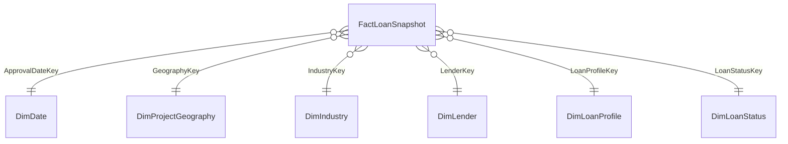
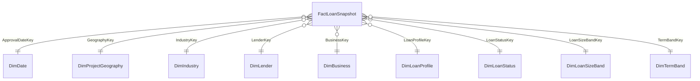

# So sánh hai phương án Star Schema SBA 7(a)

**Ngày:** 29/09/2026. **Trạng thái:** ĐỀ XUẤT ĐỂ DUYỆT; chưa chọn phương án, chưa triển khai database/ETL/SSAS.

Tài liệu bám đúng hai đoạn DBML người dùng cung cấp, gồm sơ đồ quan hệ, bảng thuộc tính của từng Fact/Dimension, **15 câu hỏi truy vấn OLAP cho mỗi phương án** và so sánh ưu/nhược điểm. Các câu truy vấn là đặc tả nghiệp vụ có công thức và đường join, chưa phải SQL/MDX đã thực thi. Tên “Final” trong DBML A không được hiểu là nhóm đã duyệt. Hai bộ 15 câu dưới đây là đề xuất trong tài liệu này, không khẳng định đã được thống nhất trước đó.

## 1. Tóm tắt lựa chọn

| Tiêu chí | A — tinh gọn | B — mở rộng |
|---|---|---|
| Số bảng | 1 Fact + 6 Dimension = 7 | 1 Fact + 9 Dimension = 10 |
| Thuộc tính Fact | 20, gồm 6 FK phân tích | 25, gồm 9 FK phân tích |
| Grain | Một dòng CSV SBA 7(a) được công bố tại snapshot 30/06/2026 | Giống A |
| Thời gian chính | ApprovalDate → DimDate | Giống A |
| Kỳ hạn | TermBand + TermBandSort trong DimLoanProfile | DimTermBand riêng |
| Phân loại doanh nghiệp | Không có | DimBusiness: BusinessType + BusinessAge |
| Nhóm quy mô vốn | Chưa có band trong schema | DimLoanSizeBand riêng |
| Lãi suất ban đầu | Không giữ giá trị rate | InitialInterestRate + RateKnownCount trong Fact |

**Khuyến nghị:** chọn **A** nếu ưu tiên hoàn thiện 15 câu OLAP tập trung và giảm phần phải triển khai. Chọn **B** nếu nhóm thực sự muốn phân tích doanh nghiệp, quy mô vốn và lãi suất, đồng thời có thời gian xác minh quy tắc bổ sung. B rộng hơn về nội dung; nhiều dimension hơn không tự chứng minh chất lượng đồ án tốt hơn.

## 2. Quy ước chung

### 2.1. Grain, population và snapshot

- Đếm **dòng công bố**, dùng `SUM(RecordCount)`, không gọi là số khoản vay hay doanh nghiệp duy nhất. `LoanSnapshotKey` không phải SBA LoanID. Không tự loại dòng giống nhau.
- `P` là các dòng của snapshot **2026-06-30**, FY phê duyệt và slicer đang chọn. Đề xuất mặc định gồm mọi trạng thái. Nếu loại `CANCLD`/`COMMIT`, phải ghi rõ và áp dụng nhất quán cho các tổng, mẫu số và kỳ so sánh.
- Cả hai schema **không có AsOfDate/AsOfDateKey**. Cần metadata cấp file/batch, truy qua `SourceFileID`, xác nhận snapshot duy nhất. Đây là yêu cầu triển khai ngoài sơ đồ, chưa phải một bảng audit đã được thiết kế. Không nạp chồng nhiều snapshot rồi cộng các measure như một tập độc lập.
- Trạng thái là quan sát tại snapshot theo cohort phê duyệt, không phải trạng thái lịch sử ở cuối từng FY. Cohort khác nhau có thời gian quan sát khác nhau.
- Giữ `LoanStatusRaw`, gồm `P I F`. Canonical mapping chỉ dùng sau xác minh; `EXEMPT` không tự mang nghĩa đã trả hết hoặc sẽ không charge-off.

### 2.2. Ký hiệu và công thức

`F=FactLoanSnapshot`, `D=DimDate`, `G=DimProjectGeography`, `I=DimIndustry`, `L=DimLender`, `LP=DimLoanProfile`, `S=DimLoanStatus`; riêng B thêm `B=DimBusiness`, `Z=DimLoanSizeBand`, `T=DimTermBand`. Mỗi dimension nối trực tiếp F qua FK tương ứng; D nối qua ApprovalDateKey.

| Ký hiệu | Công thức và ý nghĩa |
|---|---|
| N | SUM(RecordCount), số dòng công bố trong P |
| A | SUM(GrossApproval), tổng vốn phê duyệt |
| Gua | SUM(SBAGuaranteedApproval), tổng bảo lãnh tại phê duyệt |
| J | SUM(JobsSupported), tổng jobs do lender báo cáo |
| AvgA | SUM(GrossApproval của dòng có amount)/N_amount, với N_amount là số dòng có GrossApproval không NULL; khi amount đầy đủ thì N_amount=N |
| ShareA(g) | 100 × A của nhóm g / A của parent |
| GuaranteeRatio | 100 × Gua/A trên cùng tập dòng có đủ hai amount; không AVG tỷ lệ dòng |
| NonSBA | SUM(GrossApproval − SBAGuaranteedApproval) trên dòng có đủ hai amount; bằng A−Gua khi hai tổng dùng đúng tập đó |
| StatusShare(s) | 100 × N có LoanStatusRaw=s / N của mọi trạng thái trong cùng lát cắt |
| C | SUM(GrossChargeOffAmount) với LoanStatusRaw='CHGOFF' |
| YoY | 100 × (A kỳ hiện tại − A kỳ trước)/A kỳ trước; hai cửa sổ tương đương |

Mẫu số không dương hoặc kỳ trước không có dữ liệu → NULL/“không xác định”. Tỷ lệ và bình quân phải tính lại từ thành phần khi roll-up, không cộng tỷ lệ hoặc lấy trung bình bình quân nhóm. SUM bỏ qua NULL: cần báo độ phủ, không tự coi thiếu là 0.

Parent của ShareA bỏ bộ lọc thuộc tính chia nhóm, giữ FY và slicer khác. State có parent là toàn bộ state trong FY; county có parent là state đang chọn; Top 10 lender có mẫu là **mọi lender**, không chỉ Top 10. Khi gỡ lọc lender cần xử lý cả LocationID và BankName để mẫu không còn bị giữ ở lender hiện tại. Unknown/Missing nếu có vẫn thuộc parent và cần hiển thị.

### 2.3. Thời gian, hierarchy và cách diễn giải

- Theo thiết kế cung cấp, FY bắt đầu 01/10. FiscalYear = YEAR(FullDate) + 1 nếu tháng ≥ 10; FiscalMonth = ((MONTH(FullDate)+2) mod 12)+1; FiscalQuarter = floor((FiscalMonth−1)/3)+1. Khi triển khai cần đối soát ApprovalFY nguồn.
- FY2026 chỉ tới 30/06/2026: so 01/10/2025–30/06/2026 với 01/10/2024–30/06/2025. FY2020 không có kỳ trước nếu chỉ dùng file FY2020–Present. Không ngoại suy FY2026 thành năm đầy đủ.
- Fiscal hierarchy: FY → quý trong FY → tháng trong FY → ngày. Khóa nhóm quý/tháng phải gồm FY. Calendar hierarchy dùng riêng, không trộn quý dương lịch vào FY.
- County luôn định danh kèm state. CongressionalDistrict không là con của County; nhánh State → CongressionalDistrict dùng khóa state+district. SBADistrictOffice là trục riêng.
- Ngành phân tích theo cặp NaicsCode+NaicsDescription; roll-up sector chờ reference/version đã xác minh. Nhóm theo code có thể cộng các description variants, không join gây nhân Fact.
- Amount là phê duyệt/charge-off, không là dư nợ, giải ngân hoặc net SBA loss. Đơn vị tiền cần xác nhận trước nhãn báo cáo chính thức theo catalog hiện tại. JobsSupported không đo số người duy nhất hoặc tác động tạo việc làm nhân quả.

### 2.4. Thuộc tính mới, dẫn xuất và chỉ tiêu tính lúc truy vấn

Các cột dưới đây **có trong DBML đề xuất nhưng không phải cột nguyên bản của CSV**. “Có trong A/B” nói về hai sơ đồ được gửi, không có nghĩa rule hoặc reference đã được duyệt. Cột lấy thẳng từ CSV như `GrossApproval`, `BusinessType`, `BusinessAge`, `TermInMonths`, `InitialInterestRate` (B) không liệt kê là thuộc tính dẫn xuất.

| Thuộc tính trong schema | Có trong | Bảng | Tạo từ đâu / để làm gì | Trạng thái cần chốt |
|---|---|---|---|---|
| `FullDate` của DimDate; `CalendarYear`, `CalendarQuarter`, `CalendarMonth`, `MonthName` | A, B | DimDate | Dựng miền ngày từ ngày nguồn; tách ngày phê duyệt thành các cấp thời gian dương lịch. `FullDate` phản ánh giá trị ngày nguồn, còn các cấp calendar được tính từ ngày. | Quy ước member cho ngày thiếu/không hợp lệ và sort tháng. |
| `FiscalYear`, `FiscalQuarter`, `FiscalMonth` | A, B | DimDate | Tính từ `FullDate` với FY bắt đầu 01/10; dùng drill FY→quý→tháng. `ApprovalFY` trong CSV chỉ là trường nguồn để đối soát FY của ngày phê duyệt. | Kiểm khớp ApprovalFY và xử lý ngày sai/thiếu. |
| `NaicsSectorCode`, `NaicsSectorName`, `NaicsVersion`, `SectorMappingStatus` | A, B | DimIndustry | Tra mã/tên sector bằng reference NAICS đúng version, ghi version và kết quả mapping. Không suy sector đáng tin cậy chỉ từ nhãn/mã nguồn khi reference chưa xác minh. | **Cần xác minh** version, reference, cách xử lý code không khớp hoặc nhiều mô tả. |
| `LoanStatusCanonicalCode`, `StatusMappingStatus` | A, B | DimLoanStatus | Mapping từ `LoanStatusRaw` sang code chuẩn và ghi trạng thái xác minh; vẫn giữ raw. | **Cần xác minh** nghĩa/mapping `P I F` và các code liên quan. |
| `TermBand`, `TermBandSort` | A | DimLoanProfile | Phân nhóm `TermInMonths` và gán thứ tự hiển thị để so cơ cấu kỳ hạn. | Ngưỡng band, 0/Missing/Invalid và phiên bản rule chưa duyệt. |
| `LoanSizeBandCode`, `LoanSizeBandName`, `LowerBound`, `UpperBound`, `LowerBoundInclusive`, `UpperBoundInclusive`, `SortOrder`, `BandStatus` | B | DimLoanSizeBand | Định nghĩa bảng nhóm quy mô theo `GrossApproval`: mã/tên, cận, tính bao gồm, thứ tự và trạng thái nhóm. Đây là **quy tắc do dự án định nghĩa**, không phải các cột CSV. | Ngưỡng size, đơn vị amount, biên bằng nhau, 0/Missing/Invalid và version rule chưa duyệt. |
| `TermBandCode`, `TermBandName`, `MinMonths`, `MaxMonths`, `SortOrder`, `BandStatus` | B | DimTermBand | Định nghĩa bảng nhóm kỳ hạn theo `TermInMonths`: mã/tên, cận tháng, thứ tự và trạng thái nhóm. | Ngưỡng term, tính bao gồm cận, 0/Missing/Invalid và version rule chưa duyệt. |
| `RecordCount` | A, B | FactLoanSnapshot | Gán 1 cho **mỗi dòng CSV công bố** rồi SUM khi đếm. | Kiểm giá trị luôn bằng 1; không dùng làm số khoản vay duy nhất. |
| `RateKnownCount` | B | FactLoanSnapshot | Đề xuất `CASE WHEN InitialInterestRate IS NOT NULL THEN 1 ELSE 0 END`, để làm mẫu số bình quân rate và báo độ phủ. | DBML hiện cho phép NULL; khi triển khai cần chốt 0/1, không NULL và policy rate=0/bất thường. |

**Khóa và lineage cũng mới so với CSV:** `DateKey`, các surrogate key của dimension, `LoanSnapshotKey`, các FK trong Fact và `SourceFileID`, `SourceRecordOrdinal`, `SourceRowNumber`, `ETLBatchID` là cấu trúc/metadata do kho dữ liệu tạo. Chúng phục vụ join, nạp lại và truy vết, không phải chỉ tiêu phân tích. `ApprovalDateKey` là lookup từ ngày phê duyệt nguồn; `BusinessKey`, `LoanSizeBandKey`, `TermBandKey` chỉ có ở B. Danh sách đầy đủ theo từng bảng nằm ở mục 3.2 và 4.2.

Các giá trị dưới đây **không là cột lưu sẵn trong hai DBML**; chúng được tính khi truy vấn. Phân biệt chúng với các thuộc tính dẫn xuất ở bảng trên để tránh thêm cột Fact không cần thiết.

| Chỉ tiêu/logic truy vấn | Công thức hoặc cách tính | Câu hỏi dùng |
|---|---|---|
| `AvgA`, `ShareA`, `GuaranteeRatio`, `NonSBA` | Tỷ số hoặc hiệu của các tổng trên **cùng tập dòng**; parent của ShareA theo mục 2.2. | A02, A05–A06, A08–A09, A11–A12; B02, B04–B06, B08, B10–B12 |
| `YoY` và cửa sổ FYTD | Tính từ hai tổng `A` cùng kỳ; cửa sổ FYTD là predicate theo ngày cắt, không là cờ cố định trong Fact. | A03, B03 |
| `A/J`, `StatusShare(s)`, `C` | A/J khi J>0; tỷ trọng status theo count mọi status; C là SUM amount trên dòng CHGOFF. | A10, A13–A15; B09, B14–B15 |
| Bình quân `InitialInterestRate` và tỷ lệ bao phủ rate | SUM(rate có giá trị)/SUM(RateKnownCount); độ phủ = 100×SUM(RateKnownCount)/SUM(RecordCount). | B13 |

## 3. Phương án A — tinh gọn

### 3.1. Phạm vi và sơ đồ

A gồm DimDate, DimProjectGeography, DimIndustry, DimLender, DimLoanProfile và DimLoanStatus. TermBand/TermBandSort nằm trong DimLoanProfile. Các cờ rate type/revolver/collateral vẫn giữ theo DBML, dù chưa bắt buộc cho 15 câu dưới đây.



Mỗi Fact row thuộc một member của mỗi dimension; một member có 0..n Fact rows. Không có quan hệ dimension→dimension.

### 3.2. Bảng thuộc tính dữ liệu — phương án A

Kiểu và ràng buộc theo DBML. **NULL được phép** nghĩa là DBML chưa ghi NOT NULL, không chứng minh nguồn có ô thiếu. PK hiểu là không NULL. Decimal/varchar chưa có precision/scale/length. FK lấy từ Ref; các constraint bổ sung ở mục 6 chưa nằm trong DBML.

#### DimDate

**Grain:** Một ngày lịch; cần special members theo policy khi triển khai.

| Thuộc tính | Kiểu DBML | Khóa / NULL / mặc định | Nguồn hoặc cách tạo | Ý nghĩa / tổng hợp |
|---|---|---|---|---|
| `DateKey` | `int` | PK; NOT NULL | Miền ngày | Khóa ngày; quy ước mã/special member cần chốt. |
| `FullDate` | `date` | NULL được phép | Miền ngày cho ApprovalDate | Ngày lịch, vai trò chính là phê duyệt. |
| `CalendarYear` | `int` | NULL được phép | YEAR(FullDate) | Năm dương lịch. |
| `CalendarQuarter` | `int` | NULL được phép | FullDate | Quý dương lịch 1–4, nhóm kèm năm. |
| `CalendarMonth` | `int` | NULL được phép | MONTH(FullDate) | Tháng dương lịch 1–12, nhóm kèm năm. |
| `MonthName` | `varchar` | NULL được phép | FullDate | Tên tháng; sort theo CalendarMonth. |
| `FiscalYear` | `int` | NULL được phép | FullDate; đối soát ApprovalFY | Năm tài chính bắt đầu tháng 10. |
| `FiscalQuarter` | `int` | NULL được phép | FiscalMonth | Quý tài chính 1–4, nhóm kèm FY. |
| `FiscalMonth` | `int` | NULL được phép | FullDate | Tháng tài chính 1–12; tháng 10 là tháng 1. |

#### DimProjectGeography

**Grain:** Một tổ hợp quan sát ProjectState + ProjectCounty + CongressionalDistrict + SBADistrictOffice.

| Thuộc tính | Kiểu DBML | Khóa / NULL / mặc định | Nguồn hoặc cách tạo | Ý nghĩa / tổng hợp |
|---|---|---|---|---|
| `GeographyKey` | `int` | PK; NOT NULL | Sinh khóa nội bộ | Khóa DimProjectGeography; không là LoanID/ID doanh nghiệp. |
| `ProjectState` | `varchar` | NULL được phép | CSV.ProjectState | Bang dự án, khác bang borrower hoặc bank. |
| `ProjectCounty` | `varchar` | NULL được phép | CSV.ProjectCounty | County dự án; khóa nhóm gồm state. |
| `CongressionalDistrict` | `varchar` | NULL được phép | CSV.CongressionalDistrict | Khu vực quốc hội; không nằm dưới County, giữ text. |
| `SBADistrictOffice` | `varchar` | NULL được phép | CSV.SBADistrictOffice | Văn phòng SBA; trục riêng. |

#### DimIndustry

**Grain:** Một cặp NaicsCode + NaicsDescription nguồn.

| Thuộc tính | Kiểu DBML | Khóa / NULL / mặc định | Nguồn hoặc cách tạo | Ý nghĩa / tổng hợp |
|---|---|---|---|---|
| `IndustryKey` | `int` | PK; NOT NULL | Sinh khóa nội bộ | Khóa DimIndustry; không là LoanID/ID doanh nghiệp. |
| `NaicsCode` | `varchar` | NULL được phép | CSV.NaicsCode | Mã ngành text; chưa tự xác nhận phiên bản. |
| `NaicsDescription` | `varchar` | NULL được phép | CSV.NaicsDescription | Mô tả nguồn, là một phần cặp business key. |
| `NaicsSectorCode` | `varchar` | NULL được phép | NaicsCode + reference | Mã sector sau xác minh mapping. |
| `NaicsSectorName` | `varchar` | NULL được phép | Reference NAICS | Tên sector theo đúng phiên bản. |
| `NaicsVersion` | `varchar` | NULL được phép | Evidence/reference | Phiên bản được xác minh; không suy từ FY. |
| `SectorMappingStatus` | `varchar` | NULL được phép | Kết quả mapping | Trạng thái xác minh sector, mã cụ thể cần chốt. |

#### DimLender

**Grain:** Một LocationID trong snapshot, sau khi kiểm phụ thuộc thuộc tính lender.

| Thuộc tính | Kiểu DBML | Khóa / NULL / mặc định | Nguồn hoặc cách tạo | Ý nghĩa / tổng hợp |
|---|---|---|---|---|
| `LenderKey` | `int` | PK; NOT NULL | Sinh khóa nội bộ | Khóa DimLender; không là LoanID/ID doanh nghiệp. |
| `LocationID` | `varchar` | NOT NULL | CSV.LocationID | Business key đề xuất; kiểm một ID xác định một bộ thuộc tính lender. |
| `BankName` | `varchar` | NULL được phép | CSV.BankName | Tên lender hiện được gán, không dùng làm business key. |
| `BankFDICNumber` | `varchar` | NULL được phép | CSV.BankFDICNumber | Mã FDIC text, không thay LocationID. |
| `BankNCUANumber` | `varchar` | NULL được phép | CSV.BankNCUANumber | Mã NCUA text, không thay LocationID. |
| `BankStreet` | `varchar` | NULL được phép | CSV.BankStreet | Địa chỉ đường lender. |
| `BankCity` | `varchar` | NULL được phép | CSV.BankCity | Thành phố lender. |
| `BankState` | `varchar` | NULL được phép | CSV.BankState | Bang lender; khác ProjectState. |
| `BankZip` | `varchar` | NULL được phép | CSV.BankZip | ZIP text, giữ số 0 đầu. |

#### DimLoanProfile

**Grain:** Một tổ hợp quan sát ProcessingMethod + FixedorVariableInterestInd + RevolverStatus + CollateralInd + TermBand; TermBandSort phụ thuộc band.

| Thuộc tính | Kiểu DBML | Khóa / NULL / mặc định | Nguồn hoặc cách tạo | Ý nghĩa / tổng hợp |
|---|---|---|---|---|
| `LoanProfileKey` | `int` | PK; NOT NULL | Sinh khóa nội bộ | Khóa DimLoanProfile; không là LoanID/ID doanh nghiệp. |
| `ProcessingMethod` | `varchar` | NULL được phép | CSV.ProcessingMethod | Mã phương thức xử lý; giữ nhãn nguồn. |
| `TermBand` | `varchar` | NULL được phép | TermInMonths + rule | Nhóm kỳ hạn của A; ngưỡng chờ duyệt, term=0 riêng. |
| `TermBandSort` | `int` | NULL được phép | Rule term band | Thứ tự hiển thị TermBand. |
| `FixedorVariableInterestInd` | `varchar` | NULL được phép | CSV.FixedorVariableInterestInd | Nhãn loại lãi suất; giải mã F/V cần xác minh. |
| `RevolverStatus` | `varchar` | NULL được phép | CSV.RevolverStatus | Cờ nguồn, giữ mã; chưa tự diễn giải. |
| `CollateralInd` | `varchar` | NULL được phép | CSV.CollateralInd | Cờ nguồn; không phải giá trị tài sản. |

#### DimLoanStatus

**Grain:** Một nhãn LoanStatusRaw; canonical và mapping status là thuộc tính bổ sung.

| Thuộc tính | Kiểu DBML | Khóa / NULL / mặc định | Nguồn hoặc cách tạo | Ý nghĩa / tổng hợp |
|---|---|---|---|---|
| `LoanStatusKey` | `int` | PK; NOT NULL | Sinh khóa nội bộ | Khóa DimLoanStatus; không là LoanID/ID doanh nghiệp. |
| `LoanStatusRaw` | `varchar` | NULL được phép | CSV.LoanStatus | Trạng thái tại snapshot; giữ raw P I F. |
| `LoanStatusCanonicalCode` | `varchar` | NULL được phép | Raw + mapping được duyệt | Mã chuẩn hóa, không ghi đè raw. |
| `StatusMappingStatus` | `varchar` | NULL được phép | Kết quả mapping | Tình trạng xác minh mapping status. |

#### FactLoanSnapshot

**Grain:** Một record CSV công bố tại snapshot 2026-06-30; không gộp record chỉ vì giống nội dung.

| Thuộc tính | Kiểu DBML | Khóa / NULL / mặc định | Nguồn hoặc cách tạo | Ý nghĩa / tổng hợp |
|---|---|---|---|---|
| `LoanSnapshotKey` | `bigint` | PK; NOT NULL | Sinh khóa nội bộ | PK Fact, không là SBA LoanID. |
| `ApprovalDateKey` | `int` | FK → DimDate.DateKey; NOT NULL | CSV.ApprovalDate → DimDate | FK ngày phê duyệt, trục cohort chính. |
| `GeographyKey` | `int` | FK → DimProjectGeography.GeographyKey; NOT NULL | Lookup dimension tương ứng | Khóa DimProjectGeography; không là LoanID/ID doanh nghiệp. |
| `IndustryKey` | `int` | FK → DimIndustry.IndustryKey; NOT NULL | Lookup dimension tương ứng | Khóa DimIndustry; không là LoanID/ID doanh nghiệp. |
| `LenderKey` | `int` | FK → DimLender.LenderKey; NOT NULL | Lookup dimension tương ứng | Khóa DimLender; không là LoanID/ID doanh nghiệp. |
| `LoanProfileKey` | `int` | FK → DimLoanProfile.LoanProfileKey; NOT NULL | Lookup dimension tương ứng | Khóa DimLoanProfile; không là LoanID/ID doanh nghiệp. |
| `LoanStatusKey` | `int` | FK → DimLoanStatus.LoanStatusKey; NOT NULL | Lookup dimension tương ứng | Khóa DimLoanStatus; không là LoanID/ID doanh nghiệp. |
| `GrossApproval` | `decimal` | NULL được phép | CSV.GrossApproval | SUM trong một snapshot; vốn phê duyệt, không là dư nợ. |
| `SBAGuaranteedApproval` | `decimal` | NULL được phép | CSV.SBAGuaranteedApproval | SUM trong một snapshot; bảo lãnh tại phê duyệt. |
| `GrossChargeOffAmount` | `decimal` | NULL được phép | CSV.GrossChargeOffAmount | Lưu nguồn; KPI C lọc CHGOFF ở query, không là net SBA loss. |
| `JobsSupported` | `int` | NULL được phép | CSV.JobsSupported | SUM jobs lender báo; không là số người duy nhất. |
| `TermInMonths` | `int` | NULL được phép | CSV.TermInMonths | Quan sát số tháng, không SUM để diễn giải; giữ 0 để kiểm. |
| `RecordCount` | `int` | NOT NULL; default 1 | Hằng 1 mỗi record | SUM để đếm; default 1 chưa tự cấm giá trị khác 1. |
| `FirstDisbursementDate` | `date` | NULL được phép | CSV.FirstDisbursementDate | Ngày giải ngân đầu, lưu trực tiếp; chưa là date role. |
| `PaidInFullDate` | `date` | NULL được phép | CSV.PaidInFullDate | Ngày nguồn lưu trực tiếp, cần kiểm thứ tự và status. |
| `ChargeOffDate` | `date` | NULL được phép | CSV.ChargeOffDate | Ngày charge-off nguồn; thiếu/bất thường audit riêng. |
| `SourceFileID` | `varchar` | NOT NULL | Registry file ingestion | Mã file bất biến gắn checksum/snapshot; không là thuộc tính CSV. |
| `SourceRecordOrdinal` | `bigint` | NOT NULL | CSV parser | Thứ tự record; cùng SourceFileID định danh lần xuất hiện. |
| `SourceRowNumber` | `bigint` | NULL được phép | CSV parser | Dòng vật lý bắt đầu nếu có; không thay ordinal khi CSV multiline. |
| `ETLBatchID` | `varchar` | NOT NULL | Registry batch | Mã batch kỹ thuật phục vụ truy vết. |


### 3.3. Bộ 15 câu hỏi truy vấn OLAP cho A

Mọi câu áp dụng quy ước mục 2. Mã A01–A15 là mã riêng của tài liệu này, không thay thế BQ ID trong repo. Cột **nội dung** viết theo nhịp “tính gì → theo chiều nào → để thấy gì”; phần cuối là mục đích phân tích, chưa phải kết luận rút ra từ dữ liệu.

| ID | Nội dung bài toán phân tích | Công thức / chỉ tiêu | Thuộc tính / bảng liên quan | Điều kiện tính |
|---|---|---|---|---|
| A01 | Tính tổng vốn phê duyệt và số hồ sơ công bố theo năm, quý rồi tháng tài chính, để thấy giai đoạn nào danh mục mở rộng hoặc thu hẹp. | `A = SUM(GrossApproval)`; `N = SUM(RecordCount)` | F: GrossApproval, RecordCount, ApprovalDateKey; D: FiscalYear, FiscalQuarter, FiscalMonth | Nhóm quý/tháng kèm FY; FY2026 mới tới 30/06. |
| A02 | Tính số hồ sơ và quy mô vốn phê duyệt bình quân theo phương thức xử lý qua từng FY, để thấy phương thức nào gắn với hồ sơ có quy mô lớn hơn. | `N`, `N_amount`; `AvgA = SUM(GrossApproval có giá trị)/N_amount`, kèm `A` | F: GrossApproval, RecordCount; D: FiscalYear; LP: ProcessingMethod | `N_amount>0`; báo cả số dòng công bố và số dòng có amount. |
| A03 | Tính mức tăng hoặc giảm vốn phê duyệt so với cùng kỳ năm trước cho từng bang dự án, để nhận ra bang có biến động mạnh theo thời gian. | `YoY = 100 × (A_t − A_trước)/A_trước`, kèm hai tổng `A` | F: GrossApproval; D: FullDate, FiscalYear; G: ProjectState | FY2026 so FYTD tới 30/06; FY2020 thiếu năm trước trong file; mẫu ≤0 trả NULL. |
| A04 | Tính tổng vốn SBA bảo lãnh theo phương thức xử lý và FY, để thấy phương thức nào đóng góp nhiều nhất vào quy mô bảo lãnh đã phê duyệt. | `Gua = SUM(SBAGuaranteedApproval)`, kèm `N` | F: SBAGuaranteedApproval, RecordCount; D: FiscalYear; LP: ProcessingMethod | Chỉ diễn giải là bảo lãnh tại phê duyệt; báo độ phủ amount khi cần. |
| A05 | Tính tỷ phần bảo lãnh SBA trên tổng vốn phê duyệt theo bang và ngành, để thấy nơi nào có mức bảo lãnh tương đối cao hoặc thấp. | `GuaranteeRatio = 100 × Gua/A`, kèm `Gua`, `A` | F: hai amount; D: FiscalYear; G: ProjectState; I: NaicsCode, NaicsDescription | Tử/mẫu trên cùng tập đủ hai amount; `A>0`; sector chỉ dùng sau khi xác minh mapping. |
| A06 | Tính phần vốn phê duyệt nằm ngoài bảo lãnh SBA theo lender hiện được gán và phương thức xử lý, để thấy phần phân bổ này tập trung ở đâu. | `NonSBA = SUM(GrossApproval − SBAGuaranteedApproval)`, kèm hai tổng nguồn | F: GrossApproval, SBAGuaranteedApproval; D: FiscalYear; L: LocationID, BankName; LP: ProcessingMethod | Chỉ các dòng có đủ hai amount; lender xác định bằng LocationID; không gọi là dư nợ hay tổn thất thực tế. |
| A07 | Tính số hồ sơ và vốn phê duyệt ở từng county trong mỗi bang, để nhận diện county tập trung quy mô phê duyệt lớn nhất. | `N`, `A`; xếp hạng county theo `A` trong từng state | F: RecordCount, GrossApproval; D: FiscalYear; G: ProjectState, ProjectCounty | County luôn ghép với state; nêu cách xử lý hòa hạng và missing county. |
| A08 | Tính tỷ trọng vốn phê duyệt của mỗi bang trong từng FY, để thấy danh mục tập trung vào một vài bang hay phân tán rộng. | `ShareA(state) = 100 × A_state/A_mọi_state` | F: GrossApproval; D: FiscalYear; G: ProjectState | Mẫu là mọi state trong cùng FY và các slicer khác, gồm Unknown nếu có; mẫu >0. |
| A09 | Tính cơ cấu vốn phê duyệt theo ngành trong từng bang qua các FY, để thấy ngành dẫn đầu và sự dịch chuyển cơ cấu địa phương. | `N`, `A`, `ShareA(ngành trong state×FY)` | F: RecordCount, GrossApproval; D: FiscalYear; G: ProjectState; I: NaicsCode, NaicsDescription | Mẫu là mọi ngành trong cùng state×FY; phân tích sector chờ reference/version. |
| A10 | Tính số jobs được báo cáo và vốn phê duyệt trên một job theo ngành, bang, để so sánh quy mô vốn tương ứng với chỉ tiêu việc làm được khai báo. | `J = SUM(JobsSupported)`; `A/J`, kèm `N` | F: JobsSupported, GrossApproval, RecordCount; D: FiscalYear; G: ProjectState; I: NaicsCode | Hai tổng trên cùng tập có đủ đầu vào; `J>0`; không tự loại dòng có jobs=0; không diễn giải nhân quả. |
| A11 | Tính vốn phê duyệt của 10 lender lớn nhất theo từng FY và tỷ trọng của họ trong toàn bộ lender, để thấy mức độ tập trung danh mục theo lender hiện được gán. | Xếp hạng `A` giảm dần; `ShareA(lender)` và `100 × A_Top10/A_mọi_lender` | F: GrossApproval, RecordCount; D: FiscalYear; L: LocationID, BankName | Xếp hạng theo LocationID, hòa hạng xử lý nhất quán; mẫu gồm mọi lender, không chỉ Top 10. |
| A12 | Tính số hồ sơ và tỷ trọng vốn ở từng nhóm kỳ hạn theo phương thức xử lý, FY, để thấy cấu trúc kỳ hạn khác nhau giữa các phương thức. | `N`, `A`, `ShareA(TermBand trong FY×method)` | F: RecordCount, GrossApproval, TermInMonths; D: FiscalYear; LP: ProcessingMethod, TermBand, TermBandSort | Ngưỡng band cần duyệt; term=0/Missing tách riêng; mẫu mọi TermBand trong cùng FY×method. |
| A13 | Tính số hồ sơ và tỷ trọng từng trạng thái theo cohort phê duyệt, phương thức xử lý, để thấy cơ cấu trạng thái quan sát được tại snapshot. | `N_status`; `StatusShare(s) = 100 × N_status/N_mọi_status` | F: RecordCount; D: FiscalYear; LP: ProcessingMethod; S: LoanStatusRaw | Mẫu mọi status cùng FY×method; giữ nguyên nhãn `P I F`; cohort khác tuổi quan sát. |
| A14 | Tính tỷ trọng hồ sơ `CHGOFF` đã quan sát theo cohort, bang và ngành, để nhận diện lát cắt có tỷ trọng cao cần xem xét sâu hơn. | `100 × N_CHGOFF/N_mọi_status`, kèm cả hai count | F: RecordCount; D: FiscalYear; G: ProjectState; I: NaicsCode; S: LoanStatusRaw | Mẫu mọi status cùng lát cắt; công bố cỡ mẫu/tuổi cohort; không gọi là tỷ lệ vỡ nợ cuối cùng. |
| A15 | Tính tổng gross charge-off đã ghi nhận theo cohort phê duyệt, bang và ngành, để thấy phần giá trị charge-off tập trung ở đâu. | `C = SUM(GrossChargeOffAmount)` khi status=`CHGOFF`, kèm `N_CHGOFF` | F: GrossChargeOffAmount, ChargeOffDate, RecordCount; D: FiscalYear; G: ProjectState; I: NaicsCode; S: LoanStatusRaw | Nhóm theo ApprovalDate; ChargeOffDate chỉ phục vụ kiểm dữ liệu, không loại dòng thiếu ngày khỏi tổng cohort. |

**Giới hạn:** A không giữ BusinessType/BusinessAge/InitialInterestRate, nên không thể khôi phục chúng chỉ từ bảng hiện có. Có thể nhóm quy mô vốn bằng CASE từ GrossApproval nhưng cần rule/semantic grouping dùng chung. A13 đã chứa nhãn P I F; không cần một câu riêng chỉ để đổi bộ lọc trạng thái.

## 4. Phương án B — mở rộng

### 4.1. Phạm vi và sơ đồ

B thêm DimBusiness, DimLoanSizeBand và DimTermBand. DimLoanProfile bỏ TermBand/TermBandSort vì kỳ hạn chuyển sang dimension riêng. Fact thêm ba FK cùng InitialInterestRate và RateKnownCount.



Mỗi Fact row thuộc một member của mỗi dimension; một member có 0..n Fact rows. Không có quan hệ dimension→dimension.

### 4.2. Bảng thuộc tính dữ liệu — phương án B

Kiểu và ràng buộc theo DBML. **NULL được phép** nghĩa là DBML chưa ghi NOT NULL, không chứng minh nguồn có ô thiếu. PK hiểu là không NULL. Decimal/varchar chưa có precision/scale/length. FK lấy từ Ref; các constraint bổ sung ở mục 6 chưa nằm trong DBML.

#### DimDate

**Grain:** Một ngày lịch; cần special members theo policy khi triển khai.

| Thuộc tính | Kiểu DBML | Khóa / NULL / mặc định | Nguồn hoặc cách tạo | Ý nghĩa / tổng hợp |
|---|---|---|---|---|
| `DateKey` | `int` | PK; NOT NULL | Miền ngày | Khóa ngày; quy ước mã/special member cần chốt. |
| `FullDate` | `date` | NULL được phép | Miền ngày cho ApprovalDate | Ngày lịch, vai trò chính là phê duyệt. |
| `CalendarYear` | `int` | NULL được phép | YEAR(FullDate) | Năm dương lịch. |
| `CalendarQuarter` | `int` | NULL được phép | FullDate | Quý dương lịch 1–4, nhóm kèm năm. |
| `CalendarMonth` | `int` | NULL được phép | MONTH(FullDate) | Tháng dương lịch 1–12, nhóm kèm năm. |
| `MonthName` | `varchar` | NULL được phép | FullDate | Tên tháng; sort theo CalendarMonth. |
| `FiscalYear` | `int` | NULL được phép | FullDate; đối soát ApprovalFY | Năm tài chính bắt đầu tháng 10. |
| `FiscalQuarter` | `int` | NULL được phép | FiscalMonth | Quý tài chính 1–4, nhóm kèm FY. |
| `FiscalMonth` | `int` | NULL được phép | FullDate | Tháng tài chính 1–12; tháng 10 là tháng 1. |

#### DimProjectGeography

**Grain:** Một tổ hợp quan sát ProjectState + ProjectCounty + CongressionalDistrict + SBADistrictOffice.

| Thuộc tính | Kiểu DBML | Khóa / NULL / mặc định | Nguồn hoặc cách tạo | Ý nghĩa / tổng hợp |
|---|---|---|---|---|
| `GeographyKey` | `int` | PK; NOT NULL | Sinh khóa nội bộ | Khóa DimProjectGeography; không là LoanID/ID doanh nghiệp. |
| `ProjectState` | `varchar` | NULL được phép | CSV.ProjectState | Bang dự án, khác bang borrower hoặc bank. |
| `ProjectCounty` | `varchar` | NULL được phép | CSV.ProjectCounty | County dự án; khóa nhóm gồm state. |
| `CongressionalDistrict` | `varchar` | NULL được phép | CSV.CongressionalDistrict | Khu vực quốc hội; không nằm dưới County, giữ text. |
| `SBADistrictOffice` | `varchar` | NULL được phép | CSV.SBADistrictOffice | Văn phòng SBA; trục riêng. |

#### DimIndustry

**Grain:** Một cặp NaicsCode + NaicsDescription nguồn.

| Thuộc tính | Kiểu DBML | Khóa / NULL / mặc định | Nguồn hoặc cách tạo | Ý nghĩa / tổng hợp |
|---|---|---|---|---|
| `IndustryKey` | `int` | PK; NOT NULL | Sinh khóa nội bộ | Khóa DimIndustry; không là LoanID/ID doanh nghiệp. |
| `NaicsCode` | `varchar` | NULL được phép | CSV.NaicsCode | Mã ngành text; chưa tự xác nhận phiên bản. |
| `NaicsDescription` | `varchar` | NULL được phép | CSV.NaicsDescription | Mô tả nguồn, là một phần cặp business key. |
| `NaicsSectorCode` | `varchar` | NULL được phép | NaicsCode + reference | Mã sector sau xác minh mapping. |
| `NaicsSectorName` | `varchar` | NULL được phép | Reference NAICS | Tên sector theo đúng phiên bản. |
| `NaicsVersion` | `varchar` | NULL được phép | Evidence/reference | Phiên bản được xác minh; không suy từ FY. |
| `SectorMappingStatus` | `varchar` | NULL được phép | Kết quả mapping | Trạng thái xác minh sector, mã cụ thể cần chốt. |

#### DimLender

**Grain:** Một LocationID trong snapshot, sau khi kiểm phụ thuộc thuộc tính lender.

| Thuộc tính | Kiểu DBML | Khóa / NULL / mặc định | Nguồn hoặc cách tạo | Ý nghĩa / tổng hợp |
|---|---|---|---|---|
| `LenderKey` | `int` | PK; NOT NULL | Sinh khóa nội bộ | Khóa DimLender; không là LoanID/ID doanh nghiệp. |
| `LocationID` | `varchar` | NOT NULL | CSV.LocationID | Business key đề xuất; kiểm một ID xác định một bộ thuộc tính lender. |
| `BankName` | `varchar` | NULL được phép | CSV.BankName | Tên lender hiện được gán, không dùng làm business key. |
| `BankFDICNumber` | `varchar` | NULL được phép | CSV.BankFDICNumber | Mã FDIC text, không thay LocationID. |
| `BankNCUANumber` | `varchar` | NULL được phép | CSV.BankNCUANumber | Mã NCUA text, không thay LocationID. |
| `BankStreet` | `varchar` | NULL được phép | CSV.BankStreet | Địa chỉ đường lender. |
| `BankCity` | `varchar` | NULL được phép | CSV.BankCity | Thành phố lender. |
| `BankState` | `varchar` | NULL được phép | CSV.BankState | Bang lender; khác ProjectState. |
| `BankZip` | `varchar` | NULL được phép | CSV.BankZip | ZIP text, giữ số 0 đầu. |

#### DimBusiness

**Grain:** Một cặp BusinessType + BusinessAge, phân biệt Missing và Unanswered; không phải một doanh nghiệp.

| Thuộc tính | Kiểu DBML | Khóa / NULL / mặc định | Nguồn hoặc cách tạo | Ý nghĩa / tổng hợp |
|---|---|---|---|---|
| `BusinessKey` | `int` | PK; NOT NULL | Sinh khóa nội bộ | Khóa DimBusiness; không là LoanID/ID doanh nghiệp. |
| `BusinessType` | `varchar` | NULL được phép | CSV.BusinessType | Loại hình nguồn; Missing riêng. |
| `BusinessAge` | `varchar` | NULL được phép | CSV.BusinessAge | Nhóm tuổi nguồn; Missing khác Unanswered. |

#### DimLoanProfile

**Grain:** Một tổ hợp quan sát ProcessingMethod + FixedorVariableInterestInd + RevolverStatus + CollateralInd; không chứa size/term band.

| Thuộc tính | Kiểu DBML | Khóa / NULL / mặc định | Nguồn hoặc cách tạo | Ý nghĩa / tổng hợp |
|---|---|---|---|---|
| `LoanProfileKey` | `int` | PK; NOT NULL | Sinh khóa nội bộ | Khóa DimLoanProfile; không là LoanID/ID doanh nghiệp. |
| `ProcessingMethod` | `varchar` | NULL được phép | CSV.ProcessingMethod | Mã phương thức xử lý; giữ nhãn nguồn. |
| `FixedorVariableInterestInd` | `varchar` | NULL được phép | CSV.FixedorVariableInterestInd | Nhãn loại lãi suất; giải mã F/V cần xác minh. |
| `RevolverStatus` | `varchar` | NULL được phép | CSV.RevolverStatus | Cờ nguồn, giữ mã; chưa tự diễn giải. |
| `CollateralInd` | `varchar` | NULL được phép | CSV.CollateralInd | Cờ nguồn; không phải giá trị tài sản. |

#### DimLoanStatus

**Grain:** Một nhãn LoanStatusRaw; canonical và mapping status là thuộc tính bổ sung.

| Thuộc tính | Kiểu DBML | Khóa / NULL / mặc định | Nguồn hoặc cách tạo | Ý nghĩa / tổng hợp |
|---|---|---|---|---|
| `LoanStatusKey` | `int` | PK; NOT NULL | Sinh khóa nội bộ | Khóa DimLoanStatus; không là LoanID/ID doanh nghiệp. |
| `LoanStatusRaw` | `varchar` | NULL được phép | CSV.LoanStatus | Trạng thái tại snapshot; giữ raw P I F. |
| `LoanStatusCanonicalCode` | `varchar` | NULL được phép | Raw + mapping được duyệt | Mã chuẩn hóa, không ghi đè raw. |
| `StatusMappingStatus` | `varchar` | NULL được phép | Kết quả mapping | Tình trạng xác minh mapping status. |

#### DimLoanSizeBand

**Grain:** Một nhóm quy mô theo bộ rule được chọn, gồm special members theo policy.

| Thuộc tính | Kiểu DBML | Khóa / NULL / mặc định | Nguồn hoặc cách tạo | Ý nghĩa / tổng hợp |
|---|---|---|---|---|
| `LoanSizeBandKey` | `int` | PK; NOT NULL | Sinh khóa nội bộ | Khóa DimLoanSizeBand; không là LoanID/ID doanh nghiệp. |
| `LoanSizeBandCode` | `varchar` | NULL được phép | Rule size band | Mã nhóm quy mô. |
| `LoanSizeBandName` | `varchar` | NULL được phép | Rule size band | Tên nhóm quy mô hiển thị. |
| `LowerBound` | `decimal` | NULL được phép | Rule size band | Cận dưới amount; quy ước vô hạn cần chốt. |
| `UpperBound` | `decimal` | NULL được phép | Rule size band | Cận trên amount; quy ước vô hạn cần chốt. |
| `LowerBoundInclusive` | `boolean` | NULL được phép | Rule size band | Có bao gồm cận dưới hay không. |
| `UpperBoundInclusive` | `boolean` | NULL được phép | Rule size band | Có bao gồm cận trên hay không. |
| `SortOrder` | `int` | NULL được phép | Rule band tương ứng | Thứ tự hiển thị, không sort alphabet. |
| `BandStatus` | `varchar` | NULL được phép | Rule band tương ứng | Trạng thái nhóm, ví dụ normal/zero/missing/invalid cần chốt; không là version rule. |

#### DimTermBand

**Grain:** Một nhóm kỳ hạn theo bộ rule được chọn, gồm special members theo policy.

| Thuộc tính | Kiểu DBML | Khóa / NULL / mặc định | Nguồn hoặc cách tạo | Ý nghĩa / tổng hợp |
|---|---|---|---|---|
| `TermBandKey` | `int` | PK; NOT NULL | Sinh khóa nội bộ | Khóa DimTermBand; không là LoanID/ID doanh nghiệp. |
| `TermBandCode` | `varchar` | NULL được phép | Rule term band | Mã nhóm; ZeroUnverified/Short/Medium/Long còn là đề xuất. |
| `TermBandName` | `varchar` | NULL được phép | Rule term band | Tên nhóm kỳ hạn. |
| `MinMonths` | `int` | NULL được phép | Rule term band | Cận dưới tháng; chốt bao gồm cận. |
| `MaxMonths` | `int` | NULL được phép | Rule term band | Cận trên tháng; chốt bao gồm cận và không giới hạn. |
| `SortOrder` | `int` | NULL được phép | Rule band tương ứng | Thứ tự hiển thị, không sort alphabet. |
| `BandStatus` | `varchar` | NULL được phép | Rule band tương ứng | Trạng thái nhóm, ví dụ normal/zero/missing/invalid cần chốt; không là version rule. |

#### FactLoanSnapshot

**Grain:** Một record CSV công bố tại snapshot 2026-06-30; không gộp record chỉ vì giống nội dung.

| Thuộc tính | Kiểu DBML | Khóa / NULL / mặc định | Nguồn hoặc cách tạo | Ý nghĩa / tổng hợp |
|---|---|---|---|---|
| `LoanSnapshotKey` | `bigint` | PK; NOT NULL | Sinh khóa nội bộ | PK Fact, không là SBA LoanID. |
| `ApprovalDateKey` | `int` | FK → DimDate.DateKey; NOT NULL | CSV.ApprovalDate → DimDate | FK ngày phê duyệt, trục cohort chính. |
| `FirstDisbursementDate` | `date` | NULL được phép | CSV.FirstDisbursementDate | Ngày giải ngân đầu, lưu trực tiếp; chưa là date role. |
| `PaidInFullDate` | `date` | NULL được phép | CSV.PaidInFullDate | Ngày nguồn lưu trực tiếp, cần kiểm thứ tự và status. |
| `ChargeOffDate` | `date` | NULL được phép | CSV.ChargeOffDate | Ngày charge-off nguồn; thiếu/bất thường audit riêng. |
| `GeographyKey` | `int` | FK → DimProjectGeography.GeographyKey; NOT NULL | Lookup dimension tương ứng | Khóa DimProjectGeography; không là LoanID/ID doanh nghiệp. |
| `IndustryKey` | `int` | FK → DimIndustry.IndustryKey; NOT NULL | Lookup dimension tương ứng | Khóa DimIndustry; không là LoanID/ID doanh nghiệp. |
| `LenderKey` | `int` | FK → DimLender.LenderKey; NOT NULL | Lookup dimension tương ứng | Khóa DimLender; không là LoanID/ID doanh nghiệp. |
| `BusinessKey` | `int` | FK → DimBusiness.BusinessKey; NOT NULL | Lookup dimension tương ứng | Khóa DimBusiness; không là LoanID/ID doanh nghiệp. |
| `LoanProfileKey` | `int` | FK → DimLoanProfile.LoanProfileKey; NOT NULL | Lookup dimension tương ứng | Khóa DimLoanProfile; không là LoanID/ID doanh nghiệp. |
| `LoanStatusKey` | `int` | FK → DimLoanStatus.LoanStatusKey; NOT NULL | Lookup dimension tương ứng | Khóa DimLoanStatus; không là LoanID/ID doanh nghiệp. |
| `LoanSizeBandKey` | `int` | FK → DimLoanSizeBand.LoanSizeBandKey; NOT NULL | Lookup dimension tương ứng | Khóa DimLoanSizeBand; không là LoanID/ID doanh nghiệp. |
| `TermBandKey` | `int` | FK → DimTermBand.TermBandKey; NOT NULL | Lookup dimension tương ứng | Khóa DimTermBand; không là LoanID/ID doanh nghiệp. |
| `GrossApproval` | `decimal` | NULL được phép | CSV.GrossApproval | SUM trong một snapshot; vốn phê duyệt, không là dư nợ. |
| `SBAGuaranteedApproval` | `decimal` | NULL được phép | CSV.SBAGuaranteedApproval | SUM trong một snapshot; bảo lãnh tại phê duyệt. |
| `GrossChargeOffAmount` | `decimal` | NULL được phép | CSV.GrossChargeOffAmount | Lưu nguồn; KPI C lọc CHGOFF ở query, không là net SBA loss. |
| `JobsSupported` | `int` | NULL được phép | CSV.JobsSupported | SUM jobs lender báo; không là số người duy nhất. |
| `TermInMonths` | `int` | NULL được phép | CSV.TermInMonths | Quan sát số tháng, không SUM để diễn giải; giữ 0 để kiểm. |
| `InitialInterestRate` | `decimal` | NULL được phép | CSV.InitialInterestRate | Quan sát rate; average với mẫu rõ, không cộng như amount. |
| `RecordCount` | `int` | NOT NULL; default 1 | Hằng 1 mỗi record | SUM để đếm; default 1 chưa tự cấm giá trị khác 1. |
| `RateKnownCount` | `int` | NULL được phép | Dẫn xuất từ InitialInterestRate | Đề xuất 1 khi rate không NULL, ngược lại 0; known khác valid. |
| `SourceFileID` | `varchar` | NOT NULL | Registry file ingestion | Mã file bất biến gắn checksum/snapshot; không là thuộc tính CSV. |
| `SourceRecordOrdinal` | `bigint` | NOT NULL | CSV parser | Thứ tự record; cùng SourceFileID định danh lần xuất hiện. |
| `SourceRowNumber` | `bigint` | NULL được phép | CSV parser | Dòng vật lý bắt đầu nếu có; không thay ordinal khi CSV multiline. |
| `ETLBatchID` | `varchar` | NOT NULL | Registry batch | Mã batch kỹ thuật phục vụ truy vết. |


### 4.3. Bộ 15 câu hỏi truy vấn OLAP cho B

B vẫn trả lời được toàn bộ A01–A15; riêng A12 đổi sang join DimTermBand. Bộ dưới đây dành vị trí cho business/size/rate. Giới hạn 15 là lựa chọn phạm vi chính, không phải giới hạn năng lực schema. Như bộ A, mệnh đề “để thấy” là mục đích phân tích, chưa phải insight đã quan sát từ dữ liệu.

| ID | Nội dung bài toán phân tích | Công thức / chỉ tiêu | Thuộc tính / bảng liên quan | Điều kiện tính |
|---|---|---|---|---|
| B01 | Tính tổng vốn phê duyệt và số hồ sơ theo FY, quý rồi tháng tài chính, để thấy giai đoạn nào danh mục mở rộng hoặc thu hẹp. | `A = SUM(GrossApproval)`; `N = SUM(RecordCount)` | F: GrossApproval, RecordCount, ApprovalDateKey; D: FiscalYear, FiscalQuarter, FiscalMonth | Nhóm quý/tháng kèm FY; FY2026 mới tới 30/06. |
| B02 | Tính số hồ sơ và quy mô vốn bình quân theo phương thức xử lý qua từng FY, để thấy phương thức nào gắn với hồ sơ quy mô lớn hơn. | `N`, `N_amount`; `AvgA = SUM(GrossApproval có giá trị)/N_amount`, kèm `A` | F: GrossApproval, RecordCount; D: FiscalYear; LP: ProcessingMethod | `N_amount>0`; báo cả số dòng công bố và số dòng có amount. |
| B03 | Tính mức tăng hoặc giảm vốn phê duyệt so với cùng kỳ trước ở từng bang, để nhận ra bang có biến động mạnh theo thời gian. | `YoY = 100 × (A_t − A_trước)/A_trước`, kèm hai tổng `A` | F: GrossApproval; D: FullDate, FiscalYear; G: ProjectState | FY2026 so FYTD tới 30/06; FY2020 thiếu năm trước; mẫu ≤0 trả NULL. |
| B04 | Tính số hồ sơ và tỷ trọng vốn của từng nhóm quy mô trong mỗi nhóm tuổi doanh nghiệp theo FY, để thấy quy mô phê duyệt tập trung ở nhóm tuổi nào. | `N`, `A`, `ShareA(size trong FY×BusinessAge)` | F: RecordCount, GrossApproval; D: FiscalYear; B: BusinessAge; Z: LoanSizeBandCode, LoanSizeBandName | Mẫu mọi size band trong cùng FY×BusinessAge; Missing khác Unanswered; ngưỡng size chờ duyệt. |
| B05 | Tính tổng bảo lãnh và tỷ phần bảo lãnh theo phương thức xử lý, nhóm quy mô, FY, để thấy nhóm hồ sơ nào có mức bảo lãnh tương đối cao. | `Gua`; `GuaranteeRatio = 100 × Gua/A`, kèm `A` | F: SBAGuaranteedApproval, GrossApproval; D: FiscalYear; LP: ProcessingMethod; Z: LoanSizeBandCode | Tử/mẫu cùng tập đủ hai amount, `A>0`; band size cần rule đã duyệt. |
| B06 | Tính phần vốn phê duyệt ngoài bảo lãnh SBA theo lender hiện được gán và phương thức xử lý, để thấy khoản vốn này tập trung ở đâu. | `NonSBA = SUM(GrossApproval − SBAGuaranteedApproval)`, kèm hai tổng nguồn | F: GrossApproval, SBAGuaranteedApproval; D: FiscalYear; L: LocationID, BankName; LP: ProcessingMethod | Chỉ dòng đủ hai amount; LocationID là khóa lender; không diễn giải là dư nợ hay tổn thất. |
| B07 | Tính số hồ sơ và vốn phê duyệt ở từng county trong mỗi bang, để nhận diện county tập trung quy mô phê duyệt lớn nhất. | `N`, `A`; rank county theo `A` trong state | F: RecordCount, GrossApproval; D: FiscalYear; G: ProjectState, ProjectCounty | County ghép state; nêu cách xử lý hòa hạng/missing county. |
| B08 | Tính cơ cấu vốn phê duyệt theo ngành trong từng bang qua các FY, để thấy ngành dẫn đầu và sự dịch chuyển cơ cấu địa phương. | `N`, `A`, `ShareA(ngành trong state×FY)` | F: RecordCount, GrossApproval; D: FiscalYear; G: ProjectState; I: NaicsCode, NaicsDescription | Mẫu mọi ngành trong state×FY; sector chờ reference/version. |
| B09 | Tính jobs được báo cáo và vốn phê duyệt trên một job theo ngành, bang, để so sánh quy mô vốn tương ứng với việc làm được khai báo. | `J = SUM(JobsSupported)`; `A/J`, kèm `N` | F: JobsSupported, GrossApproval, RecordCount; D: FiscalYear; G: ProjectState; I: NaicsCode | A/J cùng tập đủ đầu vào, `J>0`; giữ dòng jobs=0; không diễn giải nhân quả. |
| B10 | Tính vốn của 10 lender lớn nhất theo FY và tỷ trọng của họ trong toàn bộ lender, để thấy mức độ tập trung danh mục theo lender hiện được gán. | Xếp hạng `A` giảm dần; `ShareA(lender)` và `100 × A_Top10/A_mọi_lender` | F: GrossApproval, RecordCount; D: FiscalYear; L: LocationID, BankName | Rank theo LocationID, hòa hạng nhất quán; mẫu mọi lender. |
| B11 | Tính số hồ sơ và tỷ trọng vốn ở từng nhóm kỳ hạn theo phương thức xử lý, FY, để thấy cấu trúc kỳ hạn khác nhau giữa các phương thức. | `N`, `A`, `ShareA(TermBand trong FY×method)` | F: RecordCount, GrossApproval, TermInMonths; D: FiscalYear; LP: ProcessingMethod; T: TermBandCode, TermBandName, SortOrder | Ngưỡng term chờ duyệt; term=0/Missing riêng; mẫu mọi term band trong cùng FY×method. |
| B12 | Tính số hồ sơ và cơ cấu vốn theo loại hình, tuổi doanh nghiệp trong từng bang và FY, để thấy nhóm doanh nghiệp nào chiếm tỷ trọng phê duyệt lớn. | `N`, `A`, `ShareA(BusinessType×BusinessAge trong state×FY)` | F: RecordCount, GrossApproval; D: FiscalYear; G: ProjectState; B: BusinessType, BusinessAge | Type/age là hai trục, không hierarchy; mẫu mọi tổ hợp type×age, gồm Missing/Unanswered; không đếm doanh nghiệp duy nhất. |
| B13 | Tính lãi suất ban đầu bình quân theo nhãn loại lãi suất, phương thức xử lý và nhóm quy mô, để thấy sự khác biệt giữa các nhóm hồ sơ được công bố. | `SUM(InitialInterestRate của dòng known)/SUM(RateKnownCount)`; kèm `N_known`, `N`, `100 × N_known/N` | F: InitialInterestRate, RateKnownCount, RecordCount; D: FiscalYear; LP: FixedorVariableInterestInd, ProcessingMethod; Z: LoanSizeBandCode | Bình quân không trọng số; rate NULL ngoài mẫu, zero giữ theo định nghĩa tạm; unit/FV/zero policy và size band cần xác minh. |
| B14 | Tính số hồ sơ và tỷ trọng từng trạng thái theo cohort, nhóm quy mô vốn, để thấy cơ cấu trạng thái quan sát tại snapshot khác nhau ra sao giữa các nhóm. | `N_status`; `StatusShare(s) = 100 × N_status/N_mọi_status` | F: RecordCount; D: FiscalYear; Z: LoanSizeBandCode; S: LoanStatusRaw | Mẫu mọi status trong cùng FY×size; giữ raw P I F; báo cỡ mẫu/tuổi cohort; không gọi outcome rate cuối cùng. |
| B15 | Tính tổng gross charge-off đã ghi nhận theo cohort phê duyệt, bang và ngành, để thấy phần giá trị charge-off tập trung ở đâu. | `C = SUM(GrossChargeOffAmount)` khi status=`CHGOFF`, kèm `N_CHGOFF` | F: GrossChargeOffAmount, ChargeOffDate, RecordCount; D: FiscalYear; G: ProjectState; I: NaicsCode; S: LoanStatusRaw | Nhóm theo ApprovalDate; ChargeOffDate dùng kiểm dữ liệu, không loại dòng thiếu ngày khỏi tổng cohort. |

**Định nghĩa RateKnownCount đề xuất:** 1 nếu InitialInterestRate không NULL, ngược lại 0; không để NULL. Đây là cờ có giá trị, không xác nhận giá trị hợp lệ. Theo công thức tạm, rate=0 vẫn được giữ để kiểm. Nếu quyết định loại 0/bất thường khỏi KPI, phải đổi đồng thời tập tử và mẫu B13; không dùng mẫu known cho tử đã lọc theo định nghĩa khác. Rate không là measure cộng được về nghiệp vụ; chỉ tổng hợp các thành phần để tính lại bình quân. Chưa gắn ký hiệu phần trăm cho giá trị rate trước khi xác minh đơn vị.

### 4.4. Khác biệt giữa hai bộ câu hỏi

| Nhu cầu | Bộ A | Bộ B | Ý nghĩa |
|---|---|---|---|
| Doanh nghiệp × nhóm quy mô | Không có | B04 | Cần business và size. |
| Loại hình × tuổi doanh nghiệp | Không có | B12 | B giữ thuộc tính A không giữ. |
| Lãi suất ban đầu | Không có | B13 | B giữ rate và count hỗ trợ. |
| Bảo lãnh | A04 method, A05 state/ngành | B05 method×size | B vẫn làm được A04/A05, bộ 15 chọn góc nhìn khác. |
| Tỷ trọng vốn theo state | A08 riêng | Không là câu riêng | B vẫn có đủ measure/dimension để bổ sung. |
| Trạng thái | A13 theo method; A14 CHGOFF theo state/ngành | B14 theo size gồm mọi status | B vẫn làm được hai câu A, không liệt kê riêng trong 15. |

## 5. Ưu và nhược điểm

| Tiêu chí | A | B |
|---|---|---|
| Nội dung báo cáo | Ưu: tập trung, đủ nhiều phép OLAP. Nhược: không business/rate. | Ưu: thêm business/size/rate. Nhược: cần kiểm soát phạm vi báo cáo. |
| ETL và cube | Ít bảng/FK/lookup hơn; term trong LP. | Thêm ba lookup/FK, xử lý business/size/term và measure rate. |
| Quản trị kỳ hạn | Đơn giản, nhưng ngưỡng không có trong bảng; đổi band có thể phải tạo lại nhiều tổ hợp LP/rekey Fact. | Có ngưỡng trong DimTermBand, dễ kiểm biên; đổi ngưỡng vẫn phải xét lại gán band của Fact. |
| Quản trị quy mô | CASE theo GrossApproval làm được nhưng dễ lệch rule giữa báo cáo. | Code/name/bounds/inclusivity/status dùng chung; thêm quy tắc cần duyệt. |
| Cardinality | LP chứa method×flags×term, có thể tăng số tổ hợp. | LP bỏ term, có thể giảm số tổ hợp LP. Chưa đo số dòng dimension thực tế. |
| Hiệu năng | Truy vấn method×term cần ít join hơn. | Thêm join dimension nhỏ cho term; không kết luận chậm đáng kể chỉ từ số bảng. |
| Chất lượng dữ liệu | Vẫn cần unknown keys, term band, sector, status và snapshot policy. | Thêm Missing/Unanswered business, size bounds, rate NULL/0/unit; nhiều điều kiện nghiệm thu hơn. |
| Mở rộng | Thêm business/rate sau này phải đọc lại nguồn và backfill. | Có sẵn cho B04/B12/B13. Vẫn không có dư nợ, recovery hoặc lịch sử trạng thái. |
| Giải thích khi bảo vệ | Dễ nối mỗi chiều với nhóm câu hỏi; cần giải thích lý do thu hẹp phạm vi. | Có thêm góc nhìn, band độc lập rõ; phải chứng minh nhu cầu cho các chiều bổ sung. |
| Loại mô hình | Star: dimensions nối trực tiếp Fact. | Vẫn là Star; band nối trực tiếp Fact không biến schema thành snowflake. |

Các nhận định về công sức và hiệu năng là đánh giá thiết kế, chưa benchmark hoặc profiling theo hai schema.

## 6. Các điểm cần chốt trước triển khai

1. **Phương án và bộ 15 câu.** Nếu giữ bộ 19 BQ trong repo, cần rà coverage; A không giữ business/rate để đáp ứng đầy đủ phạm vi đó.
2. **Ngưỡng band.** A cần rule term ngoài bảng; B cần size và term. Nhãn size “50k–150k” còn mơ hồ ở biên. Có thể đề xuất `(0,50k]`, `(50k,150k]`, `(150k,500k]`, `(500k,1m]`, `>1m`, cùng Zero/Missing/Invalid riêng. Term có thể đề xuất `1–60`, `61–120`, `>120` tháng cùng nhóm ZeroUnverified/Missing/Invalid. Đây là ví dụ chưa duyệt, không tự thay DBML. Khoảng phải không chồng lấn hoặc bỏ sót giá trị hợp lệ.
3. **Snapshot/lineage.** Registry cần checksum/đường dẫn/AsOfDate. Đề xuất UNIQUE(SourceFileID,SourceRecordOrdinal) để nạp lại cùng file không nhân dòng; constraint này chưa có trong DBML. CSV ordinal khác số dòng vật lý khi có trường nhiều dòng.
4. **Lookup/FK.** FK Fact đều NOT NULL nên cần policy member Unknown/Missing/Invalid. Kiểm một LocationID→một bộ thuộc tính lender; NOT NULL của LocationID không thay UNIQUE. Lookup dimension phải một-một để không nhân Fact.
5. **Kiểu vật lý.** Chốt precision/scale decimal và length varchar theo profiling/engine. Khi chọn SQL Server, boolean cần ánh xạ kiểu thích hợp, chẳng hạn bit. Tài liệu chưa tạo DDL.
6. **Mapping.** Xác minh version/reference NAICS, canonical status và nhãn mã. Giữ raw tách khỏi canonical; không tự bỏ khoảng trắng P I F rồi coi nghĩa đã được xác minh.
7. **Aggregation.** Chốt population, parent, NULL amount/jobs và rate policy. B cần bảo đảm RateKnownCount phù hợp tập tử/mẫu.
8. **Ngày sự kiện.** FirstDisbursementDate/PaidInFullDate/ChargeOffDate lưu trực tiếp Fact, chưa có date role. SQL có thể nhóm theo ngày này, nhưng cube muốn hierarchy lịch cần thêm role/mapping. Không dùng ApprovalDate để trả lời nhầm “charge-off phát sinh năm nào”.
9. **Version rule.** Cả hai chưa có BandRuleVersion; BandStatus ở B không thay version. Cần registry rule ngoài schema hoặc đề xuất thêm metadata trước khi thay band và tái lập báo cáo.

A→B cần thêm ba dimension, ba FK và hai cột Fact, backfill business/rate từ nguồn, chuyển term khỏi LP, cập nhật cube/truy vấn. B→A cần bảo toàn nguồn, thu hẹp báo cáo và tạo lại LP gồm term, cập nhật khóa liên quan. Đây không chỉ là thao tác thêm hoặc xóa bảng trống.

## 7. Căn cứ và phạm vi kiểm chứng

- Cấu trúc lấy từ hai DBML người dùng cung cấp, chép lại ở phụ lục.
- [Phạm vi 19 BQ](../business_requirements/business_questions_selection.md) và [KPI catalog ứng viên](../business_requirements/kpi_catalog.md): tham khảo nhu cầu, công thức, population và các điều kiện còn mở.
- [Schema hiện có](star_schema.md) và [coverage hiện có](schema_coverage.md) là một thiết kế khác, có date roles và DimLoanCharacteristics. Tài liệu này không ghi đè hoặc phê duyệt thay thế chúng.

Lần lập tài liệu này đọc yêu cầu và tài liệu repo, kiểm cấu trúc/cột/FK của DBML. Không tái profiling CSV, không chạy truy vấn trên dữ liệu, không sửa raw data, ETL hoặc database. Hai bộ 15 câu chưa có kết quả thực thi; các khuyến nghị vẫn là đề xuất.

## Phụ lục — DBML người dùng cung cấp

Định nghĩa bảng/cột/quan hệ giữ theo bản cung cấp. Các điều kiện và khuyến nghị ở trên không tự sửa schema.

### DBML phương án A

```dbml
// SBA 7(a) DWH - Final Simplified Star Schema
// Scope: 15 OLAP queries
// Grain: 1 published SBA 7(a) CSV record
// Snapshot: 2026-06-30
// ======================================================


// ======================================================
// DIMENSIONS
// ======================================================

Table DimDate {
  DateKey int [pk]

  FullDate date

  CalendarYear int
  CalendarQuarter int
  CalendarMonth int
  MonthName varchar

  FiscalYear int
  FiscalQuarter int
  FiscalMonth int

  Note: '''
  Main analytical time dimension.

  SBA Fiscal Year starts on October 1.

  Fiscal hierarchy:
  FiscalYear -> FiscalQuarter -> FiscalMonth -> FullDate
  '''
}


Table DimProjectGeography {
  GeographyKey int [pk]

  ProjectState varchar
  ProjectCounty varchar
  CongressionalDistrict varchar
  SBADistrictOffice varchar

  Note: '''
  Grain:
  One observed combination of project geography attributes.

  Main hierarchy:
  ProjectState -> ProjectCounty

  CongressionalDistrict is analyzed separately
  from County.
  '''
}


Table DimIndustry {
  IndustryKey int [pk]

  NaicsCode varchar
  NaicsDescription varchar

  NaicsSectorCode varchar
  NaicsSectorName varchar
  NaicsVersion varchar
  SectorMappingStatus varchar

  Note: '''
  Grain:
  One observed NAICS code + description pair.

  Sector attributes require a verified
  NAICS mapping/reference.
  '''
}


Table DimLender {
  LenderKey int [pk]

  LocationID varchar [not null]

  BankName varchar
  BankFDICNumber varchar
  BankNCUANumber varchar

  BankStreet varchar
  BankCity varchar
  BankState varchar
  BankZip varchar

  Note: '''
  Business key:
  LocationID

  Represents the lender currently assigned
  in the published snapshot.
  '''
}


Table DimLoanProfile {
  LoanProfileKey int [pk]

  ProcessingMethod varchar

  TermBand varchar
  TermBandSort int

  FixedorVariableInterestInd varchar
  RevolverStatus varchar
  CollateralInd varchar

  Note: '''
  Low-cardinality loan analysis attributes.

  TermBand is derived from TermInMonths.

  Only ProcessingMethod and TermBand
  are required by the final 15-query scope.
  Other flags may be retained for extension.
  '''
}


Table DimLoanStatus {
  LoanStatusKey int [pk]

  LoanStatusRaw varchar
  LoanStatusCanonicalCode varchar
  StatusMappingStatus varchar

  Note: '''
  Loan status observed at snapshot date.

  Raw examples:
  EXEMPT
  P I F
  CANCLD
  COMMIT
  CHGOFF

  Canonical mapping must not overwrite raw values
  unless business rules are verified.
  '''
}


// ======================================================
// FACT TABLE
// ======================================================

Table FactLoanSnapshot {
  LoanSnapshotKey bigint [pk]

  // Main analytical date
  ApprovalDateKey int [not null]

  // Dimension foreign keys
  GeographyKey int [not null]
  IndustryKey int [not null]
  LenderKey int [not null]
  LoanProfileKey int [not null]
  LoanStatusKey int [not null]

  // Stored measures
  GrossApproval decimal
  SBAGuaranteedApproval decimal
  GrossChargeOffAmount decimal
  JobsSupported int

  // Numeric observation
  TermInMonths int

  // Helper measure
  RecordCount int [not null, default: 1]

  // Source event dates kept in Fact
  FirstDisbursementDate date
  PaidInFullDate date
  ChargeOffDate date

  // Technical lineage
  SourceFileID varchar [not null]
  SourceRecordOrdinal bigint [not null]
  SourceRowNumber bigint
  ETLBatchID varchar [not null]

  Note: '''
  Grain:
  One published SBA 7(a) CSV record
  in the snapshot dated 2026-06-30.

  LoanSnapshotKey is an internal surrogate key,
  NOT an SBA LoanID.

  Source identity:
  SourceFileID + SourceRecordOrdinal.
  '''
}


// ======================================================
// RELATIONSHIPS
// ======================================================

Ref: FactLoanSnapshot.ApprovalDateKey > DimDate.DateKey

Ref: FactLoanSnapshot.GeographyKey > DimProjectGeography.GeographyKey
Ref: FactLoanSnapshot.IndustryKey > DimIndustry.IndustryKey
Ref: FactLoanSnapshot.LenderKey > DimLender.LenderKey
Ref: FactLoanSnapshot.LoanProfileKey > DimLoanProfile.LoanProfileKey
Ref: FactLoanSnapshot.LoanStatusKey > DimLoanStatus.LoanStatusKey
```

### DBML phương án B

```dbml
// SBA 7(a) Data Warehouse - Proposed Star Schema
// Simplified Date Design
// Grain: 1 published SBA 7(a) CSV record
// Snapshot: 2026-06-30
// ======================================================


// ======================================================
// DIMENSIONS
// ======================================================

Table DimDate {
  DateKey int [pk]

  FullDate date

  CalendarYear int
  CalendarQuarter int
  CalendarMonth int
  MonthName varchar

  FiscalYear int
  FiscalQuarter int
  FiscalMonth int

  Note: '''
  Main analytical time dimension.

  Used primarily for ApprovalDate.

  SBA Fiscal Year starts on October 1.

  Hierarchies:
  FiscalYear -> FiscalQuarter -> FiscalMonth -> FullDate
  CalendarYear -> CalendarQuarter -> CalendarMonth -> FullDate
  '''
}


Table DimProjectGeography {
  GeographyKey int [pk]

  ProjectState varchar
  ProjectCounty varchar
  CongressionalDistrict varchar
  SBADistrictOffice varchar

  Note: '''
  Grain:
  One observed combination of:
  ProjectState +
  ProjectCounty +
  CongressionalDistrict +
  SBADistrictOffice

  Hierarchies:
  ProjectState -> ProjectCounty

  ProjectState -> CongressionalDistrict

  CongressionalDistrict is NOT a child of County.
  '''
}


Table DimIndustry {
  IndustryKey int [pk]

  NaicsCode varchar
  NaicsDescription varchar

  NaicsSectorCode varchar
  NaicsSectorName varchar
  NaicsVersion varchar
  SectorMappingStatus varchar

  Note: '''
  Grain:
  Source pair NaicsCode + NaicsDescription.

  Sector attributes require verified
  NAICS reference/version mapping.
  '''
}


Table DimLender {
  LenderKey int [pk]

  LocationID varchar [not null]

  BankName varchar
  BankFDICNumber varchar
  BankNCUANumber varchar

  BankStreet varchar
  BankCity varchar
  BankState varchar
  BankZip varchar

  Note: '''
  Business key:
  LocationID

  Represents the lender currently assigned
  in the published snapshot.

  BankName is not used as the business key.
  '''
}


Table DimBusiness {
  BusinessKey int [pk]

  BusinessType varchar
  BusinessAge varchar

  Note: '''
  Grain:
  BusinessType + BusinessAge.

  This is a business classification dimension,
  not a borrower entity dimension.

  Missing and Unanswered should remain distinct.
  '''
}


Table DimLoanProfile {
  LoanProfileKey int [pk]

  ProcessingMethod varchar
  FixedorVariableInterestInd varchar
  RevolverStatus varchar
  CollateralInd varchar

  Note: '''
  Low-cardinality loan profile attributes.

  LoanSizeBand and TermBand are modeled
  separately as independent dimensions.
  '''
}


Table DimLoanStatus {
  LoanStatusKey int [pk]

  LoanStatusRaw varchar
  LoanStatusCanonicalCode varchar
  StatusMappingStatus varchar

  Note: '''
  Status observed at snapshot date.

  Raw examples:
  EXEMPT
  P I F
  CANCLD
  COMMIT
  CHGOFF

  P I F -> PIF mapping must be verified
  before canonicalization.
  '''
}


Table DimLoanSizeBand {
  LoanSizeBandKey int [pk]

  LoanSizeBandCode varchar
  LoanSizeBandName varchar

  LowerBound decimal
  UpperBound decimal

  LowerBoundInclusive boolean
  UpperBoundInclusive boolean

  SortOrder int
  BandStatus varchar

  Note: '''
  Project-defined analytical grouping.

  Proposed example:
  <= 50k
  50k - 150k
  150k - 500k
  500k - 1m
  > 1m

  Final boundaries must be approved
  before ETL implementation.
  '''
}


Table DimTermBand {
  TermBandKey int [pk]

  TermBandCode varchar
  TermBandName varchar

  MinMonths int
  MaxMonths int

  SortOrder int
  BandStatus varchar

  Note: '''
  Project-defined analytical grouping.

  Example proposal:
  ZeroUnverified
  Short
  Medium
  Long

  TermInMonths = 0 must not automatically
  be classified as Short.
  '''
}


// ======================================================
// FACT TABLE
// ======================================================

Table FactLoanSnapshot {
  LoanSnapshotKey bigint [pk]

  // Main analytical date
  ApprovalDateKey int [not null]

  // Other source event dates kept directly in Fact
  FirstDisbursementDate date
  PaidInFullDate date
  ChargeOffDate date

  // Dimension foreign keys
  GeographyKey int [not null]
  IndustryKey int [not null]
  LenderKey int [not null]
  BusinessKey int [not null]
  LoanProfileKey int [not null]
  LoanStatusKey int [not null]
  LoanSizeBandKey int [not null]
  TermBandKey int [not null]

  // Stored additive measures
  GrossApproval decimal
  SBAGuaranteedApproval decimal
  GrossChargeOffAmount decimal
  JobsSupported int

  // Numeric observations
  TermInMonths int
  InitialInterestRate decimal

  // Helper measures
  RecordCount int [not null, default: 1]
  RateKnownCount int

  // Technical / lineage
  SourceFileID varchar [not null]
  SourceRecordOrdinal bigint [not null]
  SourceRowNumber bigint
  ETLBatchID varchar [not null]

  Note: '''
  Grain:
  One published SBA 7(a) CSV record
  in the snapshot dated 2026-06-30.

  LoanSnapshotKey is an internal surrogate key,
  NOT an SBA LoanID.

  Source identity:
  SourceFileID + SourceRecordOrdinal.

  ApprovalDate is the main analytical time axis.

  FirstDisbursementDate,
  PaidInFullDate,
  ChargeOffDate
  are retained as source event attributes
  but are not separate date-dimension roles
  in the current main analytical scope.
  '''
}


// ======================================================
// RELATIONSHIPS
// ======================================================

Ref: FactLoanSnapshot.ApprovalDateKey > DimDate.DateKey

Ref: FactLoanSnapshot.GeographyKey > DimProjectGeography.GeographyKey
Ref: FactLoanSnapshot.IndustryKey > DimIndustry.IndustryKey
Ref: FactLoanSnapshot.LenderKey > DimLender.LenderKey
Ref: FactLoanSnapshot.BusinessKey > DimBusiness.BusinessKey
Ref: FactLoanSnapshot.LoanProfileKey > DimLoanProfile.LoanProfileKey
Ref: FactLoanSnapshot.LoanStatusKey > DimLoanStatus.LoanStatusKey
Ref: FactLoanSnapshot.LoanSizeBandKey > DimLoanSizeBand.LoanSizeBandKey
Ref: FactLoanSnapshot.TermBandKey > DimTermBand.TermBandKey
```
