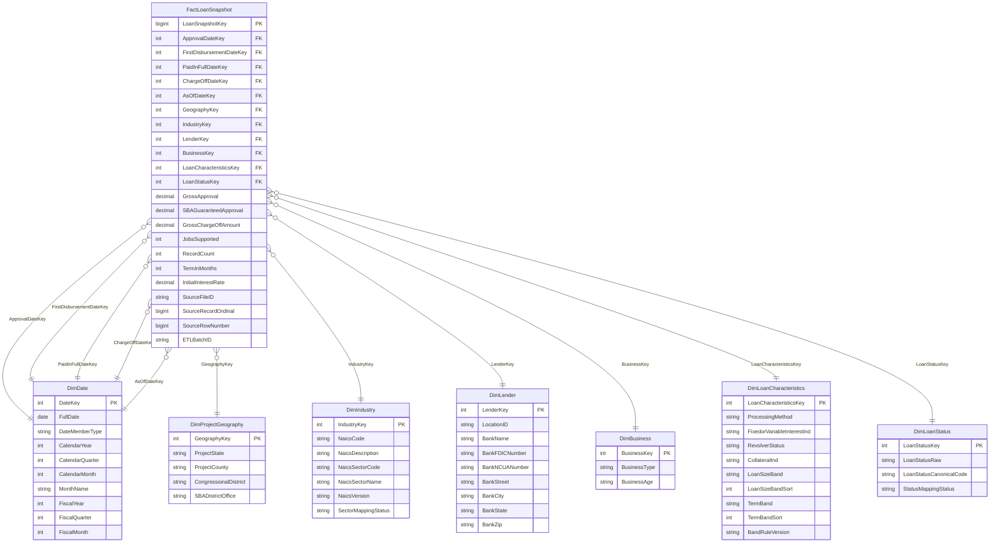

> **HISTORICAL REFERENCE — NOT CURRENT CONTRACT.** Giữ nguyên nội dung đóng góp từ `main` để tham khảo lịch sử. Các tên bảng, số Dimensions và trạng thái implementation bên dưới không thay thế [trạng thái hiện hành](../00_current_status.md), [schema hiện hành](../dimensional_model/candidate_schema.md) hoặc [kế hoạch SSIS Chương 2](../etl/chapter2_ssis_plan.md). Chương 1 hiện là `CHAPTER 1 READY TO FREEZE`; preprocessing đã tích hợp và TSV đã tái lập, warehouse/SSIS chưa triển khai.

# Star Schema logic đề xuất

PROPOSED, 2026-09-28. **1 Fact, 7 Dimension**, 5 date roles dùng chung DimDate. Kiểu dưới đây là kiểu logic minh họa, không DDL. Sector/canonical status/bands có decision gates tại [Dimension design](dimension_design.md). Không thay schema/code prototype hiện tại.

## 1. Quan hệ và hợp đồng

Mỗi Fact row thuộc đúng một member của mỗi dimension/role; member có thể là Missing/Unknown/Invalid theo policy, không mất Fact do FK NULL. Một dimension member có 0..n Fact rows. Năm đường DimDate là năm FK/alias độc lập, không năm bảng. Không FK dim-to-dim nên đây là star phẳng. Metadata SourceFileID/ETLBatchID tham chiếu audit ngoài sơ đồ phân tích, không phải thêm analytical dimensions.

Unique source identity=(SourceFileID,SourceRecordOrdinal), không unique dimension-key tuple: hai bản ghi giống hệt vẫn khác Fact row. Audit issue một-nhiều chỉ join sau aggregate/EXISTS tránh nhân measure. Chọn một AsOfDate cho mọi KPI; DateKey event sau snapshot không tự hợp lệ về nghiệp vụ.

## 2. Giải thích từng bảng

### FactLoanSnapshot

- Purpose: điểm giao giữa approval, guarantee, composition và observed outcomes của cùng tập bản ghi.
- Grain: một bản ghi CSV SBA 7(a) tại snapshot 30/06/2026, định danh bằng file bất biến và record ordinal.
- PK: LoanSnapshotKey; không business LoanID. Source identity là khóa kỹ thuật thay cho BK khoản vay chưa có.
- Stored measures: GrossApproval, SBAGuaranteedApproval, GrossChargeOffAmount, JobsSupported, RecordCount.
- Numeric observations: TermInMonths/InitialInterestRate non-additive; calculated NonSBAGuaranteedApproval không cột vật lý.
- FK: 11 trường mang FK trong sơ đồ; technical fields: SourceFileID, SourceRecordOrdinal, SourceRowNumber, ETLBatchID.
- BQ: cả 19; KPI K01–K13. [Hợp đồng measures](fact_table_design.md) xác định mẫu số/aggregation.

### DimDate

Purpose: cohort phê duyệt, drill fiscal time, mốc quan sát và ngày sự kiện. Grain một ngày lịch + special members. PK DateKey, BK FullDate cho ngày thật; DateMemberType phân biệt special. Important attributes calendar date/year/quarter/month/name; derived FiscalYear/Quarter/Month theo FY bắt đầu tháng 10. BQ cả 19 theo thời gian, đặc biệt BQ01/03/20–23; KPI K01–K13 và temporal K04. Có hai hierarchy calendar/fiscal riêng, không trộn.

### DimProjectGeography

Purpose: địa lý dự án. Grain một tổ hợp state/county/congressional district/SBA office. PK GeographyKey, BK tuple bốn thuộc tính. Important attributes chính là bốn nguồn; không cần derived core. Hierarchy State→County và State→CongressionalDistrict độc lập; office là trục riêng. BQ01–03,07,10–12,14,17,21–22 và slicer BQ15; KPI K01–K05,K08–K10,K12,K13. Giữ geography khác borrower/bank.

### DimIndustry

Purpose: nhóm ngành nguồn và đường roll-up sector có điều kiện. Grain cặp NaicsCode+NaicsDescription raw, PK IndustryKey, BK cặp này; code là grouping identifier. Important attributes code/description; derived/reference sector code/name/version/status mapping. BQ07,12,14,21,22; KPI K01,K02,K05,K08,K09,K10,K12,K13. SectorMappingStatus chưa VERIFIED thì không coi BQ12 sector đã vận hành. Chọn tuple tránh tự gộp các descriptions khác nhau hoặc join fan-out.

### DimLender

Purpose: lender hiện được gán khoản vay. Grain một LocationID trong snapshot, PK LenderKey, BK LocationID text. Important attributes LocationID, BankName, FDIC/NCUA và bank street/city/state/ZIP. Không derived core. BQ08/15; KPI K01,K02,K05,K07. FD đã kiểm trong CSV này, không dùng BankName/FDIC/NCUA thay BK. Địa chỉ bank là mô tả, không lịch sử lender ban đầu.

### DimBusiness

Purpose: profile type/age, không entity borrower. Grain tuple type+age null-safe, PK BusinessKey, BK tuple. Important attributes BusinessType/BusinessAge; không derived core. BQ04/17; KPI K01,K02,K05. Type và age là trục song song, Missing khác Unanswered. Không thêm franchise/borrower vào scope chính chỉ vì có cột nguồn.

### DimLoanCharacteristics

Purpose: phân tích method, rate type, size/term bands; giữ flags nhỏ bổ trợ. Grain tổ hợp xuất hiện của method/rate type/revolver/collateral/size/term/band version. PK LoanCharacteristicsKey, BK tuple đó. Important attributes bốn cột raw; derived bands, sort orders, BandRuleVersion. BQ02,04,06,08,16,18,20,23; KPI K01,K02,K03,K05,K06,K07,K11,K12. Giảm số dimension quá nhỏ; không tạo hierarchy giả giữa các thuộc tính.

### DimLoanStatus

Purpose: status tại AsOfDate, mapping tập trung và mẫu số mọi status. Grain nhãn LoanStatusRaw, PK LoanStatusKey, BK raw label. Derived/reference LoanStatusCanonicalCode/StatusMappingStatus chỉ điền theo evidence; canonical PIF còn OPEN. BQ20–23 và status filters cho vốn; KPI K01,K12,K13. Cho phép loại status filter ở K12 mà giữ các chiều khác, không suy trạng thái lịch sử.

## 3. Giới hạn của sơ đồ

Đây là schema đề xuất, không kết quả triển khai database. Những field có mặt trong diagram có thể nullable/chưa activate vì rule chưa chốt. NaicsSectorName DEFERRED; các ngày sự kiện không làm phát sinh Fact transaction. Không có DimBorrower, DimProgram, DimFranchise hoặc LoanID. Cấu trúc bảng audit/reference cụ thể để bước mapping/ETL quyết định; hiện chỉ đặc tả thuộc tính metadata cần thiết, không thêm bảng phân tích ngoài bảy dimensions.
